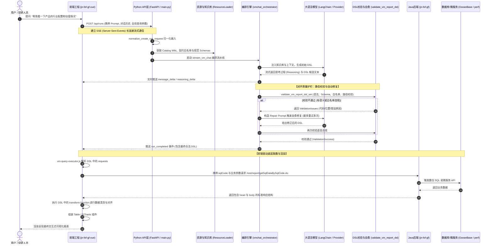

# Python 项目业务流程与数据流架构说明文档

> 本文档系统阐述了当前核心工程 **`vmchat-hermes-replacement-python`** 的系统定位、业务流向、端到端数据流转机制以及闭环自愈校验链路。

---

## 一、项目定位与核心业务使命

在整套智能金融报表系统（VM Chat）中，本工程扮演着 **“AI 编排大脑与契约执行中枢”** 的角色：

- **历史背景**：原系统采用 Hermes Agent，存在逻辑黑盒、规范执行不严、容易产生幻觉字段等问题。
- **核心目标**：纯 Python 现代架构重构，接收用户投资意图问答，精确检索 36 个业务模块 Wiki 知识库与执行白名单契约，驱动大模型生成 100% 结构合规、可直接执行的 **VM Report DSL**，并通过严格的本地运行时校验与自动修复循环，交付给前端渲染。

---

## 二、端到端数据流全景图



---

## 三、各阶段数据流详细拆解

### 阶段 1：请求接入与参数标准化（Ingress & Normalization）
- **入口端点**：`main.py` 中的 `POST /api/runs`
- **通信协议**：HTTP SSE（Server-Sent Events）流式推流。
- **核心数据对象**：
  - 前端传入包含 `message`（自然语言提问）、`history`（多轮问答上下文）以及 `globalParameters`（全局查询上下文：`fundCode` 产品代码、`beginDate` 起始日期、`endDate` 截止日期、`benchmark` 基准代码等）。
  - 通过 `app/compatibility/hermes_request.py` 中的 `normalize_create_run_request` 转换为强类型的 `VmChatInput` 对象。

### 阶段 2：知识库动态挂载与契约绑定（Catalog & Contract Binding）
- **核心组件**：`app/resources/resource_loader.py`
- **装配资源**：
  1. `resources/catalog/execution-contract.json`：**执行白名单契约**。定义全部合法 `moduleId`、`sqlCode` 及 `submoduleIds`，超出白名单的任何调用均在后续步骤被拦截。
  2. `resources/catalog/modules/*.md`：**36 个业务模块 Wiki 文档**。包含每个模块可渲染的视图类型（table/echarts）、候选维度、候选指标、响应数据集字段映射路径（如 `body.lastData[].F_701A`）。
  3. `resources/skill/references/`：DSL 规范文件（`dsl-spec.md`、`dsl-table.md`、`dsl-echarts.md`、`merge-rules.md` 及 `dsl.schema.json`）。

### 阶段 3：Prompt 工程与模型推理编排（Prompting & Orchestration）
- **核心组件**：`app/orchestrator/vmchat_orchestrator.py` 与 `app/prompt/generate_prompt.py`
- **处理逻辑**：
  - `build_generate_prompt` 将用户意图、全局参数、候选模块 Wiki、DSL 生成准则拼接成结构化系统提示词。
  - 通过 `LangChainVmChatProvider`（基于 LangChain 封装各大模型接入驱动）发起流式生成。
  - 在生成过程中，实时解析 SSE 块：
    - `reasoning_delta`：输出大模型的思考与归因过程，在前端即时显示“思考中”；
    - `message_delta`：输出 DSL 文本片段。

### 阶段 4：质量守卫：严格校验与自愈修复循环（Validation & Repair Loop）
这是保证大模型输出 100% 可用、杜绝前端报错的核心护栏：
- **核心组件**：`app/validation/validate_vm_report_dsl.py`
- **校验矩阵（全部通过才放行）**：
  1. **Schema 校验**：严格对照 `dsl.schema.json`，检查根结构、`title`、`requests`、`transform`、`views` 的语法。
  2. **执行契约校验**：核对 DSL `requests` 里的 `moduleId` 和 `sqlCode` 是否严格匹配 `execution-contract.json`。**杜绝模型幻觉伪造 sqlCode**。
  3. **字段路径校验**：检查 `transform` 中提取的字段是否为该模块 Wiki 中真实存在的响应路径（如 `body[].assetName`）。
  4. **视图逻辑校验**：若为 Table 视图检查 columns 列定义；若为 ECharts 视图检查 dataset、series、xAxis/yAxis 绑定。
- **自动修复（Self-Repair Loop）**：
  - 若 `validate_vm_report_dsl_set` 发现错误（如字段拼写错误、漏传必要参数、图表配错维度），编排引擎**绝不直接向前端抛错**；
  - 编排引擎自动调用 `app/prompt/repair_prompt.py` 将**原始错误 DSL + 错误具体位置 + 规范要求**组合成 Repair Prompt；
  - 再次提交大模型进行定向修正，并重新执行校验；在规定重试阈值内完成自愈收敛。

### 阶段 5：前端执行与组件装配（Frontend Execution & Rendering）
- **数据落地**：校验通过的 DSL 最终以 `run_completed` 事件打包发出，前端 `jn-fof-gf-vue` 接收完整 DSL。
- **底层调度**：
  - 前端运行时 `vm-query-executor.js` 读取 DSL 中的 `requests` 列表；
  - 提取 `sqlCode`，组装全局 `fundCode`, `beginDate`, `endDate`，通过 `vm-api.js` 调用 Java 后端数据接口 `/rest/report/getSqlDataBySqlCode.do`；
  - 后端根据 `sqlCode` 驱动数仓 SQL 或微服务返回 `{ head, body }` 数据；
  - 前端执行 DSL 中的沙箱清洗函数（`transform.function`）进行多数据集对齐与计算；
  - 驱动 ECharts / Element UI Table 完成报表上屏渲染。

---

## 四、核心工程目录映射

```
vmchat-hermes-replacement-python/
├── app/
│   ├── main.py                     # FastAPI 启动入口与路由控制
│   ├── orchestrator/
│   │   └── vmchat_orchestrator.py  # 核心编排引擎 (流式控制、调用、自愈重试)
│   ├── prompt/
│   │   ├── generate_prompt.py      # 生成 Prompt 构建器
│   │   └── repair_prompt.py        # 修复 Prompt 构建器 (自愈核心)
│   ├── validation/
│   │   └── validate_vm_report_dsl.py# 本地严谨 DSL 校验器
│   ├── provider/
│   │   └── langchain_provider.py   # 模型接入驱动 (流式/思维链适配)
│   ├── resources/
│   │   └── resource_loader.py      # Catalog 知识库与规范文件加载器
│   └── compatibility/
│       ├── hermes_request.py       # 请求参数归一化与输入适配
│       └── hermes_events.py        # SSE 流式事件序列化
├── resources/
│   ├── catalog/
│   │   ├── execution-contract.json # 36个模块的执行白名单与 sqlCode 映射
│   │   ├── submodules.json         # 带有子模块的层级定义
│   │   └── modules/*.md            # 36个 VM 模块的字段、视图 Wiki 规范
│   └── skill/references/
│       ├── dsl.schema.json         # 官方严格 DSL JSON Schema
│       ├── dsl-spec.md             # DSL 全量规范说明
│       └── merge-rules.md          # 模块合并审查规则
└── delivery/                       # 交付文档目录
    ├── 01_business_metrics_and_merge_rules.md
    ├── 02_vm_modules_sql_statements.md
    ├── 03_sql_code_inventory.md
    ├── 04_python_project_dataflow_architecture.md
    └── scripts/
        └── all_vm_modules_queries.sql
```
