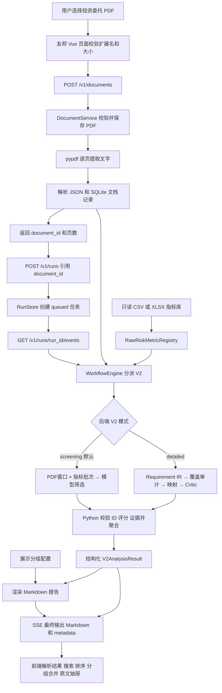
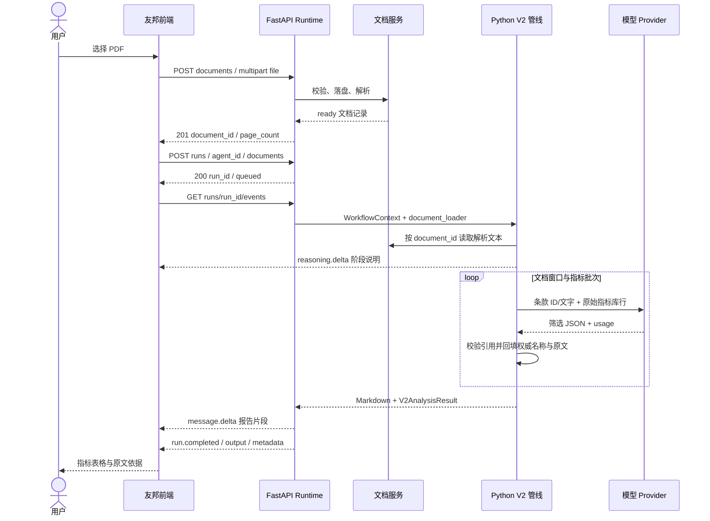

# 友邦投资委托分析 V2：前后端流程与 Python 实现说明

> 核对日期：2026-10-07。以当前两个仓库的工作区源码为准，包含尚未提交的实现；不代表已上线版本。
>
> 核心需求：用户上传投资委托 PDF，Python 读取文档并筛选风险指标库中相关的指标，返回理由、匹配分和原文依据，前端展示为可筛选的表格。

后续更新：2026-10-07 已用用户上传的权益 PDF 通过 OMP 完成真实上传、模型分析和页面展示；模型为 google-antigravity/gemini-3.8-flash，返回 21 个相关指标。具体启动方法及运行证据见 [OMP 真实模型联调说明](/Volumes/onePiece/公司前端项目/AI项目/vmchat-hermes-replacement-python/docs/aia-mandate-risk-v2-omp.md)。本文的通用架构仍适用，当前本地预览连接该 OMP 服务。

## 1. 文档范围与关键结论

本文说明友邦新增的 `mandateRiskV2` 页面与 Python `mandate-risk-analysis-v2` 工作流。旧 `mandateRisk` 页面、绩效报表 DSL 生成和其他 Agent 不作为本模块主流程。

当前功能的准确含义是：**根据 PDF 的投资目标、策略、约束和风险暴露，分析哪些库指标与文档相关，生成风险指标筛选表**。它没有实现对 PDF 内任意原始表格的版式还原，也没有根据持仓自动计算久期、VaR 或组合收益率。

需要先理解的六件事：

1. 指标名称与算法来自只读指标库，模型选择库行，Python 按库行 ID 回填名称；模型不负责创造指标名称。
2. Python 用 `pypdf` 提取可复制文字；扫描件 OCR 当前不在实现范围内。
3. 默认 `screening` 模式直接阅读 PDF 和完整指标库；`detailed` 模式额外执行要求提取、覆盖审计、指标映射与独立 Critic 复核。
4. 匹配分是模型给出的文档关联程度，范围为 0–100；它不是统计校准的正确概率，也不是合规结论。
5. 原文与页码由 Python 从解析结果重建，模型只提供证据条款 ID。
6. 前端已完成独立预览、模拟流程及真实 OMP 模型链路验证；当前 localhost:8002 运行真实 OMP 适配服务，页面已展示用户权益 PDF 的 21 个相关指标。7310 的原服务保留，但当前预览不经由该端口调用模型。

## 2. 仓库、入口和模块边界

| 部分 | 当前位置 | 作用 |
| --- | --- | --- |
| 友邦前端仓库 | `/Volumes/onePiece/公司前端项目/友邦绩效/datadriver-fund-amc-tyjx-vue` | Vue 业务系统与独立 V2 页面 |
| Python 后端仓库 | `/Volumes/onePiece/公司前端项目/AI项目/vmchat-hermes-replacement-python` | HTTP API、文档存储、任务运行、模型与 V2 管线 |
| 新页面 | `src/views/mandateRiskV2/index.vue` | 上传、进度、输入区、对话及结果布局 |
| 业务路由 | `/#/mandate-risk-v2` | 沿用业务系统登录控制的独立页面入口 |
| 独立预览 | `http://127.0.0.1:19529/` | 单独编译新模块，不依赖完整业务菜单 |
| Agent | `agents/mandate_risk_v2_lab/agent.json` | ID 为 `mandate-risk-v2-lab`，绑定 V2 工作流 |
| Role | `roles/requirement-analyst.json` | 描述分析角色，默认角色为 `requirement-analyst` |
| 工作流入口 | `app/workflow/graphs/mandate_risk_v2.py` | `MandateRiskV2Workflow`，分派两条分析路径 |

前端样式参考 [shadcn-ui/chatbot-template](https://github.com/shadcn-ui/chatbot-template) 的聊天布局、留白、附件输入区和过程折叠。实际实现沿用 Vue 2 和 Element UI，没有将 React/Next.js 模板直接移植进友邦。

## 3. 技术栈及其具体职责

以下版本来自仓库声明，带 `>=` 的依赖表示最低约束；实际安装版本由锁文件和运行环境决定。

| 层级 | 技术 | 在本模块里的职责 |
| --- | --- | --- |
| 前端视图 | Vue 2.5.17、Vue Router 3.0.2 | 响应式页面、组件、独立路由 |
| 前端组件 | Element UI `^2.12.0` | 输入框、筛选下拉、按钮、设置对话框、原文抽屉 |
| 表格 | 原生 HTML table、`rowspan` | 指标逐行显示，仅分组列纵向合并 |
| 前端网络 | 原生 Fetch、FormData | 上传 PDF、创建任务、读取事件流；本模块未使用项目 Axios 实例 |
| 流读取 | ReadableStream、TextDecoder | 处理跨网络分块的 UTF-8 和 SSE 帧 |
| 中止 | 浏览器 AbortController | 停止当前请求并隔离旧任务回调 |
| 报告显示 | Showdown 1.8.6、HTML 标签/链接过滤 | Markdown 转换与安全展示 |
| 构建 | Webpack 4.16.5、Babel、vue-loader | 沿用友邦构建链；页面构建使用 Node 14.19.0 |
| Python | Python `>=3.10` | 异步编排、文件解析、结构化校验、结果聚合 |
| HTTP 服务 | FastAPI `>=0.103.0`、Uvicorn `>=0.23.0` | REST API、鉴权、中间件、SSE 响应 |
| 数据模型 | Pydantic `>=2.0.0` | 请求、PDF、模型 JSON、结果结构及引用校验 |
| PDF | pypdf `>=6.0.0` | 逐页提取文本及页码来源 |
| 模型适配 | LangChain、langchain-deepseek、langchain-openai | 对接 DeepSeek 或 OpenAI 兼容模型服务 |
| 并发编排 | asyncio、Semaphore、gather、wait_for | 指标批次并发、超时控制和结果汇总 |
| 文档持久化 | 文件系统、SQLite | 保存原始 PDF、解析 JSON 和文档记录 |
| 会话持久化 | SQLite | 通用 Runtime 保存会话及完成的用户/助手轮次 |
| 任务运行状态 | 进程内 RunStore | 保存任务状态、最终文本和 SSE 回放缓冲 |
| 测试 | pytest、pytest-asyncio、httpx；前端 Node/assert/jsdom | 后端局部行为测试和前端契约/状态测试 |

仓库也包含 LangGraph 和知识检索能力。**当前 V2 工作流直接通过 `WorkflowEngine → MandateRiskV2Workflow` 执行 Python 管线，不是一个编译后的 LangGraph 状态图**。V2 当前把原始指标库按批次送给模型，没有走向量召回、Embedding 或知识库 RAG。其他工作流可以使用这些基础设施。

## 4. 全链路数据流



用户的二进制 PDF 只在上传接口发送一次。创建分析任务时传 `document_id`，Python 再按 ID 读取已经解析的文件；不把完整 PDF 文件复制进聊天历史。



失败路径不会发送成功结果：上传失败返回 HTTP 错误；管线执行失败发出 `run.failed`；前端收到错误后保留可重试状态。

## 5. 前端逻辑

### 5.1 组件与文件分工

| 文件 | 职责 |
| --- | --- |
| `index.vue` | 整体布局、PDF 拖入/选择、输入、健康状态、设置、历史样例 |
| `api.js` | 接口地址与认证配置、上传、创建 run、SSE 解码 |
| `session.js` | 上传与分析状态、消息、报告、取消、重试、任务身份隔离 |
| `report.js` | 安全 Markdown、结构化结果/表格解析、过滤排序、分组合并跨度 |
| `components/RiskResult.vue` | 表格、勾选、搜索、评分筛选、原文抽屉和完整报告 |
| `components/SafeMarkdown.vue` | 报告及流式内容渲染 |
| `samples.json` | 固收/权益历史结果，仅用于查看展示效果 |
| `preview/webpack.config.js` | 只构建该模块的独立预览与 `/mandate-api` 代理 |

### 5.2 上传和任务状态

主要成功路径为：

```text
idle → uploading → ready → creating-run → streaming → completed
```

`ready` 表示文档上传解析成功；页面随即自动发起分析。失败进入 `error`。停止后，已有文档则回到 `ready`，没有文档则回到 `idle`。

每次上传新文件都会清空旧报告、聊天与任务 ID，并产生新的会话 ID。每个操作持有自己的 AbortController；只有当前 controller 对应的事件可以写入页面。这样停止、换文件或清空后，旧任务即使迟到返回，也不会覆盖新结果。

前端停止操作目前是中止 Fetch/SSE 连接，**没有调用后端 `/cancel` 接口**。后端有断开清理机制，但不能由此承诺上游模型供应商立即停止生成或停止计费。

### 5.3 指标名称、分组和各列来源

| 页面字段 | 数据来源 | 处理规则 |
| --- | --- | --- |
| 指标名称 | 结构化结果的 `metric.metric_name` | 直接显示指标库名称；无结构化结果时读取 Markdown“名称”列 |
| 分组 | 优先读取 Markdown 报告里的展示分组 | 后端按 `metric-display-groups.json` 映射名称到 key/core/Indicator |
| 分组备用值 | `metric.risk_type_1` | 无对应 Markdown 行时使用；该风险分类与展示分组不是同一字段 |
| Mandate 解读 | `score_reason` 或 `requirements[].mapping_reason` | 优先指标级评分理由，否则合并关联解释 |
| 匹配分 | `match_score` | 范围外/缺失值显示“未评分”，不补零 |
| 组合值 | 当前尚未接持仓计算接口 | 展示“—” |
| 参考组合 | 当前尚未接权威参考组合数据 | 展示“—” |
| 原文依据 | `requirements[].mapping_evidence` | 展示 Python 返回的页码与原文 |
| 人工确认项 | `requirements[].review_notes` | 在结构化依据抽屉中展示 |
| 指标算法 | `metric.algorithm` | 只读展示指标库原值 |

结果选择优先级：`metadata.mandate_risk_v2.result` 高于 Markdown。`screening` 展示 `screened_metrics`；`detailed` 当前展示 `matched_metrics + candidate_metrics`。若详细模式的这些项没有指标级评分，页面保留“未评分”，没有用 Markdown 的分数覆盖它。无结构化结果时才退回解析六列 Markdown 表格。

当前排序为 **key → core → Indicator**；其他分组放后面，按首次出现的分组顺序排列。同组内匹配分降序，未评分放最后。搜索和评分过滤后再计算 `rowspan`，连续相同且非空的分组纵向合并；只合并分组列，指标名称、勾选及其他列保持逐行显示。

勾选是当前页面的本地核对状态，不保存到后台，不自动导入或修改指标库。完整报告仍可展开查看，包括详细模式的待确认项、指标库缺口等表格之外的信息。

### 5.4 SSE 和报告安全处理

`api.js` 用 Fetch 读取流，而非浏览器 EventSource，便于携带 Bearer 请求头。TextDecoder 以流方式处理中文字符分块；缓冲区按空行拆 SSE 帧，兼容 CRLF、多行 `data:` 和结束时的最后一帧。

`reasoning.delta` 更新过程说明，`message.delta` 累加报告片段。只有 `run.completed` 才切换为最终结果表格；最终 `output` 优先于累计片段。若流提前结束而没有完成/失败事件，页面报错并支持重新分析。

Showdown 只负责转换 Markdown。随后另有标签允许列表、属性清理和链接协议过滤，去除脚本、图片及事件属性等内容；允许的链接仅为 HTTP、HTTPS 或页内锚点。Markdown 回退依据也来自清理后的 HTML。

## 6. API 契约

浏览器默认请求 `/mandate-api`；开发代理移除该前缀，转发至 Python。接口设置也可填写完整后端地址。配置 `SERVICE_API_KEY` 时，受保护的 `/v1/*` 请求需要 `Authorization: Bearer ...`；未配置该 Key 时当前鉴权函数放行。`/health` 不在该鉴权范围。

| 接口 | 用途 | 当前页面是否调用 |
| --- | --- | --- |
| `GET /health` | 服务状态、运行模型/Provider、V2 模式等 | 是，界面连接检查使用 6 秒超时 |
| `POST /v1/documents` | 上传并解析一个 PDF | 是 |
| `GET /v1/documents/{documentId}` | 查询文档公开元数据 | 当前主链路未额外轮询 |
| `POST /v1/runs` | 创建分析任务，返回 queued | 是 |
| `GET /v1/runs/{runId}/events` | 启动/读取任务或回放终态事件 | 是 |
| `POST /v1/runs/{runId}/start` | 通用 Runtime 后台执行入口 | 否 |
| `POST /v1/runs/{runId}/cancel` | 通用 Runtime 取消入口 | 否 |
| `GET /v1/runs/{runId}/snapshot` | 通用 Runtime 状态快照 | 否 |

### 6.1 文档上传

请求为 `multipart/form-data`，字段名 `file`。前端使用 FormData，交给浏览器生成 boundary。

成功返回 HTTP 201，示意：

```json
{
  "document": {
    "document_id": "doc_example",
    "filename": "mandate.pdf",
    "mime_type": "application/pdf",
    "sha256": "...",
    "size_bytes": 102400,
    "page_count": 3,
    "status": "ready",
    "created_at": "...",
    "error": null
  }
}
```

文件系统的 `file_path` 和 `parsed_path` 不对外返回。上传响应是在解析完成后返回，并非先返回 ID 再由前端轮询。

### 6.2 创建 V2 分析任务

页面实际请求形状如下，ID 和文本为示意值：

```json
{
  "agent_id": "mandate-risk-v2-lab",
  "role_id": "requirement-analyst",
  "workflow": "mandate-risk-analysis-v2",
  "session_id": "mandate_v2_example",
  "documents": ["doc_example"],
  "input": [{"role": "user", "content": "请分析上传的 PDF"}],
  "instructions": "",
  "skills": [],
  "tools": [],
  "context": {}
}
```

Python 标准化请求，检查 Agent、文档 ready 状态和技能权限，准备会话上下文并在 RunStore 创建任务。成功返回 HTTP 200，包含 `run_id`、`status: queued`、`session_id`、`documents` 与上下文估算信息。

**真正的工作流选择来自后端加载的 `agent.workflow`**。前端虽然发送 `workflow` 字段，运行时仍依据 Agent 注册配置分派，不能假定任意客户端字段能够改写工作流。

### 6.3 SSE 完成事件

终态事件的外层契约：

```json
{
  "event": "run.completed",
  "output": "# Mandate 风险指标筛选报告...",
  "usage": {"complete": true, "total_tokens": 12345},
  "metadata": {
    "mandate_risk_v2": {
      "phase": "complete",
      "mode": "screening",
      "result": {
        "analysis_mode": "screening",
        "coverage_status": "not_audited",
        "score_type": "model_relevance",
        "screened_metrics": []
      }
    }
  }
}
```

这是字段示意，`result` 实际包含更多字段；usage 数值也仅为例子。详细模式的外层 metadata 当前没有显式 `mode`，前端可通过 `result.analysis_mode` 识别。

HTTP 200 只代表成功打开 SSE 响应，不代表任务分析成功，必须等待 `run.completed` 或 `run.failed`。

## 7. Python Runtime：从 HTTP 到工作流

主要入口为 `app/main.py` 的 `create_app()`：初始化配置、Agent 注册、Provider、文档服务、会话存储、RunStore、并发限制与 WorkflowEngine。

执行过程：

1. `/v1/runs` 标准化请求，确认文档 ready，建立/恢复通用会话，返回 queued 任务。
2. `/events` 对任务执行 claim。任务不存在返回 404；正在被读取返回 409；终态任务回放已有事件，不重新调用模型。
3. 当前任务首次 claim 成功后，取得 RunLimiter 许可。默认容量为 4；超限通过 `run.failed` 告知繁忙。
4. 根据 Agent 找到 workflow，组装 `WorkflowContext`：Provider、运行 ID、会话 ID、文档 ID、document_loader 和取消信号等。
5. WorkflowEngine 从注册表查找并执行 `MandateRiskV2Workflow.stream()`。
6. Runtime 转发过程/正文事件，缓存 SSE 帧，保存最终 Markdown 和 metadata；等待工作流事件时每 12 秒可发送 keep-alive 注释帧。
7. 正常完成后保存用户与助手会话轮次，标记 RunStore completed，并释放运行许可；异常或断开时执行失败与清理路径。

通用 Runtime 会尝试为 JSON DSL 输出创建 artifact；V2 的主要输出是 Markdown，**不能将该通用逻辑理解为已持久化完整 V2 结构化报告 artifact**。

## 8. Python 文档处理：输入必须可追溯

### 8.1 DocumentService 的检查与落盘

后端独立检查扩展名、允许的 MIME、非空内容、大小及 `%PDF-` 文件签名。允许 `application/octet-stream` 等传输 MIME，并不代表允许任意文件，因为仍检查 PDF 名称和签名。

默认最大 20 MiB，即 `20 * 1024 * 1024` 字节。HTTP 上传入口还给 multipart 外层留出 1 MiB 开销，但真正文件内容仍不得超过文件上限。

通过校验后生成 `doc_...` UUID 和 SHA-256，写入 processing 记录。PDF 先写临时文件并 fsync，再原子替换到正式路径。解析成功后保存 JSON、把状态改为 ready；解析失败记录 failed 和错误。失败记录和已经写入的源文件没有在这条路径自动整体删除。

默认存储位置：

```text
.runtime/documents/files/doc_<id>.pdf
.runtime/documents/parsed/doc_<id>.json
.runtime/ai-documents.sqlite3
```

SHA-256 用于内容标识与追溯；当前上传实现每次生成新 ID，不能把哈希索引理解为已经实现上传去重。

### 8.2 PdfDocumentParser

`PdfReader(strict=False)` 按页提取文字，保留 `DocumentPage(page_number, text)`。可用空密码解锁的 PDF 可以继续解析，无法解锁的加密 PDF 被拒绝。无页 PDF、逐页提取失败和完全无可提取文字 PDF 均显式失败。

聚合文本保留页标记：

```text
[Page 1]
第一页文字...

[Page 2]
第二页文字...
```

空文字页仍存在于 pages 元数据中，但不进入聚合文本。页码指 PDF 物理页序号，不保证等于文档页脚印刷页码。pypdf 提取顺序受 PDF 本身结构影响，多栏、复杂表格和混合扫描页仍需要人工确认文本完整性。

### 8.3 DocumentClause 与原文证据

`split_document_clauses()` 根据页边界、句末标点、空段落及编号列表切分文字。单个排版换行不直接作为语义边界，避免一条合同句子被切碎。

每条 clause 保存：

```json
{
  "clause_id": "c0001",
  "text": "原文片段",
  "page": 2,
  "source_start": 120,
  "source_end": 160
}
```

`source_start/end` 是聚合提取文本中的字符位置，不是 PDF 坐标或二进制字节位置。程序会处理片段外围空白及部分独立页码行，保留提取文本中的证据内容；不能承诺与 PDF 视觉排版逐像素相同。

模型返回 `evidence_clause_ids` 后，`canonical_evidence()` 用 Python 持有的 clause 索引重建文字、页码和位置。模型自行改写的引文和自报页码不是最终证据来源。

## 9. Python 指标库：名称和算法的来源

工作流 `_load_registry()` 的来源优先级：

```text
注入的 metric_registry（测试/调用方提供）
    或 MANDATE_RISK_METRIC_SOURCE
    或 MANDATE_RISK_METRIC_XLSX
    或 agents/mandate_risk_ai/knowledge/raw/risk_metrics.raw.csv
```

相对路径按 Python 仓库根目录解析。默认 CSV 是 `AI测试样例信息.xlsx` 中“风险指标库”工作表的只读快照，并非实时数据库查询。本次核对该快照共有 **34 个有名称的指标行**，后续更换来源后数量可以变化。

`RawRiskMetricRegistry` 支持 CSV 和 XLSX：CSV 用标准库 csv 读取，XLSX 用 ZIP/XML 读取对应工作表。要求六列表头为：

```text
风险类型一级 / 风险类型二级 / 指标名称 / 指标算法 / Mandate字段 / 适用策略种类
```

每行保留原始单元格值、`row_id/source_row`、名称、算法和策略等字段。对合并单元格产生的分类空白，另建 `effective_risk_type_1/2` 供读取使用，不把前向填充写回源文件。重复 ID 或名称会被拒绝，源文件保留 SHA-256 供结果追溯。

模型输入中有 `raw_row_id`、名称、算法、Mandate 和策略信息。模型返回库行 ID 后，Python 遍历真实 registry，使用 `_metric_reference(metric)` 回填名称与其他原始字段。因此最终指标名称来自真实库行，而非模型响应的自由文本。

**展示分组是另一层配置**：`agents/mandate_risk_v2_lab/metric-display-groups.json` 把指标名称映射到 key/core/Indicator。本次配置分别包含 6、10、18 个名称。没有映射的名称在 Markdown 报告中显示“待分类”。这个配置不决定某指标是否应该被选中，也不修改指标库名称或算法。

## 10. Python 默认路径：快速筛选 screening

### 10.1 为什么默认走这条路径

用户当前主要需求是“上传 PDF，筛选相关库指标并看到表格”。`screening` 为此直接阅读文档与库，不先构建完整 Requirement IR，也不调用覆盖审计与 Critic。因此结果的 `coverage_status` 明确为 `not_audited`。

流程中虽然复用了 `RequirementExtractionPipeline._call_model()` 作为公共模型调用器，**这不表示 screening 执行了 RequirementExtractionPipeline.run() 的完整提取流程**。

### 10.2 文档窗口 × 指标批次

`ScreeningPipeline` 默认参数：

| 参数 | 当前默认 | 含义 |
| --- | --- | --- |
| `document_window_chars` | 60,000 | 按条款累计文档窗口的近似字符预算 |
| `batch_size` | 40 | 每批最多 40 个库指标 |
| `concurrency` | 2 | 同一任务最多两个筛选批次并发 |

每个文档窗口与每个指标批次组合都要送给模型。无重试时调用数约为：

```text
文档窗口数 × ceil(指标数 / 40)
```

当前 34 指标快照、文档能放进一个窗口时，通常只有一个筛选模型调用。若文档分成三个窗口，则同一库指标会分别接受三个文档窗口的判断，再合并证据。

60,000 是文档部分的近似字符预算，不是整条 prompt 的 token 硬上限；prompt 还包含指标库 JSON 等内容。窗口按完整 clause 切分，极长单条 clause 可能超过该目标，需要结合实际模型上下文限制判断。

### 10.3 模型任务和返回结构

模型对**每一个分配的库行**恰好返回一次判断：

| level | 含义 | 是否进入相关指标列表 |
| --- | --- | --- |
| DIRECT | 原文有明确对应的测量概念 | 是 |
| REVIEW | 有合理间接监控用途或适用条件需确认 | 是，保留差异 |
| NOT_RELEVANT | 本文档窗口没有合理关联 | 不因这一判断单独入选 |

提示词给出的评分参考是：90–100 明确对应且适用，75–89 关联清晰但有口径差异，50–74 间接监控/较弱证据，0–49 关联弱或不适用因素明显。代码不会按 DIRECT/REVIEW 强制指定固定分，也不会因分数低于 50 自动剔除；选中与否依据 level，分数供前端排序筛选。

示例 JSON，仅用于说明形状：

```json
{
  "rows": [{
    "raw_row_id": 2,
    "level": "DIRECT",
    "match_score": 92,
    "reason": "文档明确包含该风险测量概念",
    "evidence_clause_ids": ["c0001"],
    "differences": "需要确认业务口径"
  }]
}
```

合同没有直接点名某个指标、算法字段缺失或业务口径不完全一致，不会被提示词一律排除；但必须有合理业务关联和文档证据，不允许用泛化风险政策牵强支持整个指标库。

### 10.4 Python 负责的确定性校验

模型返回的是待校验 JSON，代码依次检查：

1. JSON 可以解析，Pydantic 严格结构满足字段要求且不含额外字段。
2. `raw_row_id` 为合法整数，返回 ID 集合与本批分配的库行集合完全一致，无遗漏、重复或新增。
3. level 只能是三个枚举值；分数必须为有限的 0–100 数字。
4. DIRECT/REVIEW 必须带证据 ID；证据必须属于当前文档窗口。
5. 关联理由不能是空白。

提示词要求优先给 1–3 条关键证据，但当前 schema 并没有强制“最多三条”；程序真正强制的是选中指标有证据且引用有效。

结构或引用不合法时，记录错误并附反馈再请求一次；第二次仍不合法则抛出 `MANDATE_SCREENING_INVALID`，整个工作流失败。语义判断本身没有通过这些校验就获得“完全正确”的保证，最终仍需用户核对。

### 10.5 多窗口聚合

各窗口结果按库行 ID 汇总。只要某个窗口对该行返回 DIRECT 或 REVIEW，就保留对应关联；其他窗口未提到该风险不意味着全文不适用。

每条关联用 canonical_evidence 回填真实原文。`differences` 保存到 review_notes。一个指标最终匹配分取所有已选窗口中最高的分数，理由取该最强关联的理由，**不是窗口分数平均值**。

至少一个关联是 DIRECT 时归入 matched_metrics，否则归入 candidate_metrics；所有相关指标同时进入 screened_metrics。screening 页面展示后者，统一标为相关指标。NOT_RELEVANT 的库行仍保留在 catalogue_assessments 里，便于查看全库逐行处理情况。

screening 为兼容统一结果模型，会生成 `SRC-...` 的证据型 requirement 项，`attributes.screening_evidence` 为 true。它们不是 detailed 路径通过覆盖审计生成的完整 Requirement IR，不应混淆。

结果可以是零个指标，这仍是有效成功结果，不会强行补候选或凑数量。

## 11. Python 可选路径：detailed 与 Phase A

`MANDATE_RISK_V2_MODE=detailed` 在工作流实例创建时选择详细模式，通常需重启服务后生效。`phase_a_only` 是构造参数，可用于仅验证要求提取；它不是当前页面提供的切换控件，也不是上述模式环境变量的第三个取值。

### 11.1 Phase A：Requirement IR

```text
PDF 条款 → 模型提取 requirements/definitions/contextual_facts
         → Python 校验与去重、生成稳定 ID
         → 模型覆盖审计 → 修复反馈 → 完整 Requirement IR
```

Requirement IR 是文档要求的结构化中间表示，包含目标、策略、范围、定量目标/限制、禁止、许可、条件、外部政策、治理等类型；还保留定义、上下文事实、条款证据和要求间的关系。

这一阶段不读取指标库，避免先看到库里的名称后，把文档理解成“找已有指标”的过程。

默认优先整篇阅读，近似文档预算为 60,000 字符；超出后按 32 条 clause 切批，相邻批次重叠 6 条。Python 只在类型与证据身份等指纹相符时去重，不用猜测的语义相似度合并不同要求。

校验内容包括引用条款、批次内 ID 唯一性、关系目标、约束结构与原文出处。数字、区间或符号比较要有 `raw_value_text` 等原文支撑；引用的数值/基准能在证据中追溯。Python 的这一步是结构和文本校验，不会替模型推断金融语义、评级顺序或执行单位换算。

### 11.2 覆盖审计与修复

`build_coverage_hints()` 根据原文生成需关注的覆盖线索，再由模型检查是否遗漏要求、提取不完整或仅为定义/背景。Python 检查 reviewer 的 ID、覆盖记录及账目一致性。

默认最多两轮语义修复，即最多三次“提取 → 覆盖审计”尝试。提取 JSON 校验失败可重试一次；覆盖审计返回的记录结构不合法，默认最多再修复两次。这些是不同层级的修复次数。

覆盖最终仍不完整时抛出 `MANDATE_REQUIREMENT_COVERAGE_INCOMPLETE`，不继续假装生成完整指标报告。仅 Phase A 路径到此生成 Requirement IR 报告，尚未做指标映射。

### 11.3 Phase B：完整指标库映射

通过覆盖审计后，MappingPipeline 将冻结的 IR、条款及库行送给模型：默认每批 8 个库指标，并发 2。

与快速筛选一样，完整浏览库行，但这里进一步构建 `requirement_id ↔ raw_row_id` 的关联和理由、证据、兼容性维度、分数。Python 检查每批库行处理完整、引用真实、无跨批凭空关联等。

随后模型为每条要求安排去向，主要包括：

| 去向 | 意义 |
| --- | --- |
| MAIN_TABLE | 可列入正式主表的映射 |
| PENDING_REVIEW | 仍需人工确认 |
| LIBRARY_GAP | 文档要求在当前库中没有足够对应项 |
| NON_METRIC | 属于治理/流程等非指标要求 |

候选指标与主表指标分开保存；未解决的要求也保留在结果中，不简单丢弃。

### 11.4 独立 Critic

Critic 是一次独立模型调用，用于重新检查原文、库行、映射和去向；它不意味着另一个独立模型供应商。它可以确认、指出异议、拒绝候选、补回 REVIEW 关联、调整分数或指出遗漏方面。

Python 再校验 Critic 的账目与引用。MAIN_TABLE 未获确认的映射可以降为 PENDING_REVIEW；被拒绝的候选不会继续当有效候选保留。默认 `max_critic_repairs=0`，即不自动再跑完整映射循环，但 Critic 的校验与最终裁决处理仍会执行。各阶段结构校验失败可局部重试一次。

详细模式最终生成统一 V2AnalysisResult 和详细 Markdown，保留主表、候选、差异、待确认、库缺口及非指标要求。

## 12. 模型 Provider、超时与 usage

`LLM_PROVIDER` 当前支持 `fixed`、`langchain`、`colab`。

| Provider | 含义 |
| --- | --- |
| fixed | 固定测试响应；配置默认值，不能据此认为已经连接真实 AI |
| langchain | 使用配置的模型名、API Key、Base URL 调用真实服务 |
| colab | 复用 LangChain 模型并提供文本工具调用适配，适用于相应兼容服务；不是另一个指标算法引擎 |

Provider 的 `run_skill()` 是公共调用接口名。V2 `_call_model()` 直接提供自己的系统提示词和 JSON 输入，`read_resource` 返回 RESOURCE_NOT_ALLOWED，`search_knowledge=None`。因此 V2 不依赖泛用知识搜索工具读取指标库。

当前 LangChain 适配器按模型名/Base URL 选择 ChatDeepSeek 或 ChatOpenAI，并使用 temperature 0。实际模型取决于服务启动配置，不能凭前端“Python V2”标签判断模型型号。

共同调用器默认每次模型调用 240 秒超时，收集 Provider 内容后提取 JSON。部分网络中断、连接错误、502/503 等瞬态异常最多尝试三次，重试间隔为 2 秒、4 秒；超时本身直接失败。Provider SDK 可能还有独立网络重试层，需结合 `LLM_NETWORK_RETRIES` 和适配器读取行为判断，不能把这些次数混为一个全局重试次数。

usage 来自 Provider 的 token 使用回报，不由字符数伪造。缺少任一预期调用的 usage 时标为 `complete=false`，完整总 token 只有条件满足时才汇总。网络层内部重试不一定能被最终回包的 usage 完整覆盖，因此它也不是财务账单。

**用户看到的流式内容性质**：V2 提供的是阶段过程说明；模型筛选 JSON 先在后端收集、校验，报告生成后再按片段发送 `message.delta`。这不是把模型逐 token 推理全过程直接展示到页面。

## 13. 结构化结果和存储边界

相关指标的关键结构示意：

```json
{
  "metric": {
    "raw_row_id": 2,
    "source_row": 2,
    "metric_name": "库中名称",
    "algorithm": "库中原始算法",
    "mandate": "库中 Mandate 字段",
    "strategy_type": "库中适用策略",
    "risk_type_1": "库中有效一级分类",
    "risk_type_2": "库中有效二级分类"
  },
  "match_score": 92,
  "score_reason": "最强关联的理由",
  "requirements": [{
    "mapping_level": "DIRECT",
    "mapping_reason": "该段原文与指标的关联",
    "mapping_evidence": [{
      "clause_id": "c0001",
      "text": "Python 回填的原文",
      "page": 2,
      "source_start": 120,
      "source_end": 160
    }],
    "review_notes": ["需人工核对的差异"]
  }]
}
```

该片段省略嵌套 requirement 和兼容性等字段，仅说明关键取值来源，不是完整 schema。

| 数据 | 当前保存方式 | 生命周期/限制 |
| --- | --- | --- |
| 原始 PDF | DOCUMENT_ROOT 下文件 | 当前上传路径没有自动全文档清理流程 |
| 解析结果 | DOCUMENT_ROOT 下 JSON | 文档 loader 按 ID 读取 |
| 文档记录 | SQLite documents 表 | 状态、路径、哈希等持久化 |
| 原始指标库 | CSV/XLSX 文件 | 只读；更新由外部维护源文件 |
| 展示分组 | JSON 配置 | 按指标名映射，不影响模型筛选 |
| 运行记录/事件 | 进程内 RunStore | 默认容量 100、TTL 600,000ms；内存状态不跨进程重启保留 |
| 完成的聊天轮次 | 通用 SQLite 会话存储 | 保存用户消息与助手最终输出等信息 |
| 完整 metadata | 运行事件缓冲/浏览器当前状态 | 不能假定已经独立持久化为长期 V2 报告 |
| 前端设置 | localStorage | 保存独立键 MANDATE_RISK_V2_UI_SETTINGS，可兼容读取旧设置 |
| 表格勾选 | Vue 内存状态 | 新报告或刷新后不保留 |
| 历史展示样例 | 前端 samples.json | 静态历史报告，不发分析请求 |

后端通用 RunStore 的 TTL、容量和进程内任务特征意味着：刷新页面自动恢复分析、长期报告查询、跨进程/多实例接续，不能视为当前新页面已完成的能力。

## 14. 当前实现限制与容易误解的地方

| 项目 | 当前真实行为 |
| --- | --- |
| 自定义分析关注点 | 前端会发送到 run 的 input；有上传文档时 V2 从 document_loader 取文档，未把该关注点传给 ScreeningPipeline/详细管线。因此不能保证输入框文本影响指标筛选 |
| 对话上下文 | 通用 Runtime 处理/保存会话，但当前 V2 不是根据全部聊天历史进行连续问答的助手 |
| 角色提示词 | Runtime 会读角色配置并放入 context；当前 V2 管线使用自身固定提示词，未将 context.role_prompt 作为实际筛选提示词拼入 |
| 指标库实时性 | 默认使用仓库只读快照；没有从友邦数据库实时同步库名称 |
| 文档数量 | 当前 V2 一次分析只允许一个上传文档 |
| PDF 类型 | 文本型可解析 PDF；OCR 未实现，部分有文字/部分扫描的文件仍需人工核查 |
| 原文查看 | 文本与页码抽屉；不是内嵌 PDF 查看器，也没有 PDF 坐标高亮 |
| 实际值与参考组合 | 当前没有权威业务数据链路，所以展示空占位 |
| 自动入库与合规 | 勾选不入库，相关指标不自动成为合规结论 |
| 取消与恢复 | 页面中止连接并防旧结果覆盖；无页面刷新自动恢复或保证上游计费中止 |
| 历史样例 | 可离线查看样式；不能用它证明本次真实上传成功或模型已连接 |
| 主业务应用 | 新路由已加入；独立预览已验证。完整业务应用之前受既有依赖缺失影响，不能把独立预览编译成功等同整站构建通过 |

这些是现状说明，本次文档工作没有顺带改变这些行为。

## 15. 本地运行与联调方法

### 15.1 端口要对齐

Python `AppConfig` 的声明端口默认是 7310；友邦 `/mandate-api` 开发代理默认转发 8002；独立页面预览在 19529，主业务开发服务器约定为 9528。

真正监听端口由启动命令决定。用 `uvicorn --port 8002` 时就监听 8002，不能认为 config 里写了 7310 就一定运行在该端口。

### 15.2 启动 Python V2

在 Python 仓库根目录准备依赖与环境配置。例如已有 uv 环境时：

```sh
uv sync --locked
```

真实模型所需配置示意，不包含真实凭据：

```dotenv
LLM_PROVIDER=langchain
LLM_MODEL=<实际模型名称>
LLM_BASE_URL=<实际模型服务地址>
LLM_API_KEY=<模型服务凭据，仅在后端配置>
SERVICE_API_KEY=<可选的应用接口凭据>
MANDATE_RISK_V2_MODE=screening
MANDATE_RISK_METRIC_SOURCE=agents/mandate_risk_ai/knowledge/raw/risk_metrics.raw.csv
```

随后启动：

```sh
uv run uvicorn app.main:app --host 127.0.0.1 --port 8002
```

`SERVICE_API_KEY` 是前端调用 Python 的应用凭据，`LLM_API_KEY` 是 Python 调用模型供应商的凭据，两者用途不同。真实模型 Key 不应填进前端接口设置。

### 15.3 启动友邦独立页面

在友邦仓库根目录，使用项目约定 Node 版本：

```sh
nvm use 14.19.0
BABEL_ENV=development node node_modules/webpack-dev-server/bin/webpack-dev-server.js --config src/views/mandateRiskV2/preview/webpack.config.js
```

如 Python 在其他端口/地址，可通过 `MANDATE_API_URL` 覆盖代理目标。配置了应用 Key 时，可以由开发代理的 `MANDATE_API_KEY` 注入，或在前端接口设置里填写应用 Key。生产部署需配置对应反向代理，开发 proxy 不会自动成为生产接口路由。

### 15.4 验收步骤

1. 检查 `/health`：确认 provider、model、`runtime.v2Mode` 和 workflow 列表；连接标识本身不证明模型请求一定能成功。
2. 上传一个有可提取文字的测试 PDF，确认上传响应 ready、页数和 document_id。
3. 检查创建请求的 Agent、documents，确认返回 run_id。
4. 观察 SSE 过程事件并等待 `run.completed`；确认 metadata 中存在结构化 result。
5. 核对返回指标名称能在实际加载的库中找到，raw_row_id/source_row 对应真实库行。
6. 核对抽屉证据与 PDF 页面的文字，区分物理页序号与印刷页码。
7. 核对 key/core/Indicator 顺序及仅分组列合并；过滤后不应出现跨分组合并或缺行。
8. 检查扫描件、非 PDF、失败、停止等拒绝/边界路径；不要用静态样例代替真实联调。

## 16. 错误定位与已有验证

| 现象/错误 | 优先检查 |
| --- | --- |
| 服务未连接、代理 ECONNREFUSED | Python 是否监听目标端口，代理地址是否一致 |
| 401/403/FORBIDDEN | 应用 Key 与 Bearer 头，不是模型 Key |
| UNKNOWN_AGENT | Python 是否加载 mandate-risk-v2-lab |
| DOCUMENT_TOO_LARGE | 文件上限及 MAX_DOCUMENT_BYTES |
| INVALID_PDF_SIGNATURE / INVALID_PDF | 内容是否真 PDF、解析器是否可读 |
| PDF_NO_EXTRACTABLE_TEXT | 扫描件需要预先 OCR |
| MANDATE_RISK_METRIC_LIBRARY_NOT_FOUND | 指标库路径及发布时是否带源文件 |
| MANDATE_SCREENING_INVALID | 模型 JSON 的库行、评分、证据、结构或重复记录 |
| MANDATE_MODEL_TIMEOUT | 模型请求耗时、服务可用性和窗口规模 |
| MANDATE_REQUIREMENT_COVERAGE_INCOMPLETE | detailed 要求提取最终覆盖仍不完整 |
| HTTP 200 但没有最终表格 | 检查 SSE 是否 run.failed/提前结束，而非仅看 HTTP 状态 |
| 有指标但组合值为空 | 当前尚未接组合计算，属于已知数据边界 |

前端现有局部测试：

```sh
node src/views/mandateRiskV2/tests/module.test.cjs
node node_modules/eslint/bin/eslint.js src/views/mandateRiskV2 --ext .js,.vue
```

页面构建要求 Node 14；上述逻辑测试使用支持原生 TextEncoder 的 Node 22 环境。已有验证覆盖 V2 请求参数、拒绝非 PDF、中文分块 SSE、报告/证据解析、取消与重试、分组排序和筛选后的合并跨度。浏览器也验证过模拟上传、表格、搜索、勾选、依据抽屉和响应式展示。

后端相关测试入口包括 `tests/test_documents.py`、`tests/test_mandate_risk_v2_fast_screening.py`、`tests/test_mandate_risk_v2_workflow.py`、`tests/test_mandate_risk_v2_symbolic_constraints.py` 等。可按变更范围选择运行；本次未重新执行全量后端测试。后续 OMP 联调执行了适配器的 5 个局部测试，以及用户权益 PDF 的真实上传、模型分析与页面展示；身份、原文校验和运行证据见 OMP 联调说明，未将语义适用性宣称为完整人工验收。

## 17. 源码阅读顺序与证据入口

建议先从前端接口看请求，再看 Python 工作流分支，最后读管线及校验器。以下链接指向当前本机工作区。

### 前端

- [页面入口](/Volumes/onePiece/公司前端项目/友邦绩效/datadriver-fund-amc-tyjx-vue/src/views/mandateRiskV2/index.vue)
- [接口与 SSE](/Volumes/onePiece/公司前端项目/友邦绩效/datadriver-fund-amc-tyjx-vue/src/views/mandateRiskV2/api.js)
- [会话状态](/Volumes/onePiece/公司前端项目/友邦绩效/datadriver-fund-amc-tyjx-vue/src/views/mandateRiskV2/session.js)
- [结果解析、排序与合并计算](/Volumes/onePiece/公司前端项目/友邦绩效/datadriver-fund-amc-tyjx-vue/src/views/mandateRiskV2/report.js)
- [结果表格与原文抽屉](/Volumes/onePiece/公司前端项目/友邦绩效/datadriver-fund-amc-tyjx-vue/src/views/mandateRiskV2/components/RiskResult.vue)
- [开发代理](/Volumes/onePiece/公司前端项目/友邦绩效/datadriver-fund-amc-tyjx-vue/config/index.js)

### Python

- [项目依赖](/Volumes/onePiece/公司前端项目/AI项目/vmchat-hermes-replacement-python/pyproject.toml)
- [HTTP API 与运行事件](/Volumes/onePiece/公司前端项目/AI项目/vmchat-hermes-replacement-python/app/main.py)
- [配置声明](/Volumes/onePiece/公司前端项目/AI项目/vmchat-hermes-replacement-python/app/config.py)
- [Agent 注册配置](/Volumes/onePiece/公司前端项目/AI项目/vmchat-hermes-replacement-python/agents/mandate_risk_v2_lab/agent.json)
- [工作流分派与上下文](/Volumes/onePiece/公司前端项目/AI项目/vmchat-hermes-replacement-python/app/workflow/engine.py)
- [V2 两条路径入口](/Volumes/onePiece/公司前端项目/AI项目/vmchat-hermes-replacement-python/app/workflow/graphs/mandate_risk_v2.py)
- [文档校验与落盘](/Volumes/onePiece/公司前端项目/AI项目/vmchat-hermes-replacement-python/app/documents/service.py)
- [PDF 解析](/Volumes/onePiece/公司前端项目/AI项目/vmchat-hermes-replacement-python/app/documents/parser.py)
- [条款和页码切分](/Volumes/onePiece/公司前端项目/AI项目/vmchat-hermes-replacement-python/app/mandate_risk/clauses.py)
- [指标库加载](/Volumes/onePiece/公司前端项目/AI项目/vmchat-hermes-replacement-python/app/mandate_risk/registry.py)
- [默认指标库快照](/Volumes/onePiece/公司前端项目/AI项目/vmchat-hermes-replacement-python/agents/mandate_risk_ai/knowledge/raw/risk_metrics.raw.csv)
- [展示分组配置](/Volumes/onePiece/公司前端项目/AI项目/vmchat-hermes-replacement-python/agents/mandate_risk_v2_lab/metric-display-groups.json)
- [快速筛选与聚合](/Volumes/onePiece/公司前端项目/AI项目/vmchat-hermes-replacement-python/app/mandate_risk_v2/screening.py)
- [公共模型调用、要求提取与覆盖编排](/Volumes/onePiece/公司前端项目/AI项目/vmchat-hermes-replacement-python/app/mandate_risk_v2/pipeline.py)
- [要求与原文重建](/Volumes/onePiece/公司前端项目/AI项目/vmchat-hermes-replacement-python/app/mandate_risk_v2/extractor.py)
- [覆盖校验](/Volumes/onePiece/公司前端项目/AI项目/vmchat-hermes-replacement-python/app/mandate_risk_v2/coverage.py)
- [约束原文校验](/Volumes/onePiece/公司前端项目/AI项目/vmchat-hermes-replacement-python/app/mandate_risk_v2/constraint_validator.py)
- [详细映射与 Critic](/Volumes/onePiece/公司前端项目/AI项目/vmchat-hermes-replacement-python/app/mandate_risk_v2/mapping.py)
- [映射引用校验](/Volumes/onePiece/公司前端项目/AI项目/vmchat-hermes-replacement-python/app/mandate_risk_v2/mapping_validator.py)
- [统一结果结构](/Volumes/onePiece/公司前端项目/AI项目/vmchat-hermes-replacement-python/app/mandate_risk_v2/result.py)
- [Markdown 报告](/Volumes/onePiece/公司前端项目/AI项目/vmchat-hermes-replacement-python/app/mandate_risk_v2/report.py)
- [模型服务适配](/Volumes/onePiece/公司前端项目/AI项目/vmchat-hermes-replacement-python/app/provider/langchain_provider.py)
- [任务状态与事件缓冲](/Volumes/onePiece/公司前端项目/AI项目/vmchat-hermes-replacement-python/app/runs/run_store.py)
