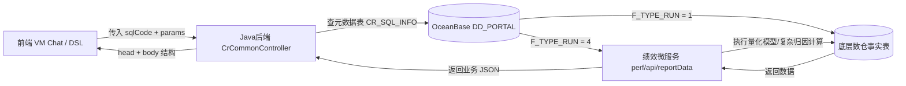

# VM 模块数据接口与 SQL 详细技术文档

本文档详细记录了系统知识库中全部 36 个 VM 报表模块的底层数据获取逻辑、接口配置、返回数据结构与对应的数仓业务 SQL 说明。

## 架构总览


---

## 模块明细索引

- [1. 大类资产收益贡献 (assetContribute)](#assetContribute)
- [2. 持仓平均PE/PB时序 (averagePePb)](#averagePePb)
- [3. 债券持仓集中度 (bondConcentrate)](#bondConcentrate)
- [4. 债券久期变动时序 (bondDurationTiming)](#bondDurationTiming)
- [5. Campisi债券绩效归因 (campisiBondAnal)](#campisiBondAnal)
- [6. 现金类持仓时序 (cashPositionTiming)](#cashPositionTiming)
- [7. 商品期货板块收益贡献 (commodityFutures)](#commodityFutures)
- [8. 商品期货净敞口时序 (commodityFuturesExposureTiming)](#commodityFuturesExposureTiming)
- [9. 期货十大盈利亏损品种 (commodityProfitLoss)](#commodityProfitLoss)
- [10. 信用风险评级分布 (creditRiskRateDistribution)](#creditRiskRateDistribution)
- [11. 固定收益类持仓时序 (fixedPositionTiming)](#fixedPositionTiming)
- [12. 组合加权久期时序 (fundDurationTiming)](#fundDurationTiming)
- [13. 持股数量时序变化图 (hldStockNumTime)](#hldStockNumTime)
- [14. A股持仓指数及板块时序 (holdPlate)](#holdPlate)
- [15. 华泰柏瑞行业配置 (hsInduStockAlloca)](#hsInduStockAlloca)
- [16. 华泰柏瑞行业分析 (hsInduStockAnal)](#hsInduStockAnal)
- [17. 华泰柏瑞行业估值 (hsInduStockVala)](#hsInduStockVala)
- [18. 行业监控 (industryMonitor)](#industryMonitor)
- [19. 最大回撤与修复时序 (maxDrawdownFQ)](#maxDrawdownFQ)
- [20. 净值走势监控 (netValMonitor)](#netValMonitor)
- [21. 产品规模走势 (netValue)](#netValue)
- [22. 期货总持仓及收益 (overallFutures)](#overallFutures)
- [23. 行业持仓分布 (positionIndustry)](#positionIndustry)
- [24. 产品基本信息 (productInfo)](#productInfo)
- [25. 风险与收益指标 (rewardRisk)](#rewardRisk)
- [26. 风险指标分析 (riskValue)](#riskValue)
- [27. 股票净敞口时序 (stockExposureTiming)](#stockExposureTiming)
- [28. 申万行业配置 (swInduStockAlloca)](#swInduStockAlloca)
- [29. 申万行业分析 (swInduStockAnal)](#swInduStockAnal)
- [30. 申万行业估值 (swInduStockVala)](#swInduStockVala)
- [31. 前十大亏损行业 (tenLossIndustry)](#tenLossIndustry)
- [32. 前十大盈利行业 (tenProfitIndustry)](#tenProfitIndustry)
- [33. 前五大行业时序 (topFiveIndustryTime)](#topFiveIndustryTime)
- [34. 前十大/前五大股票持仓时序 (topTenOrTopFiveStockPositionTime)](#topTenOrTopFiveStockPositionTime)
- [35. 交易行为分析 (tradeBehavior)](#tradeBehavior)
- [36. 区间交易分析 (tradeDuring)](#tradeDuring)

---

### <a id="assetContribute"></a>1. 大类资产收益贡献 (`assetContribute`)

- **模块标识**: `assetContribute`
- **数据库名称**: `大类资产收益贡献-信创`
- **执行编码 (`sqlCode`)**: `4c15f9fd-98c1-4280-b7bb-56893691279a`
- **运行类型 (`F_TYPE_RUN`)**: `4` (微服务接口代理)
- **子模块定义**: `无`
- **对应 Wiki 文档**: [`resources/catalog/modules/assetContribute.md`](../resources/catalog/modules/assetContribute.md)

#### ① 后端接口 URL / 转发配置 (`VC_SQL`)
```text
{$xcjxApiDomainUrl}/perf/api/reportData/sql/4c15f9fd-98c1-4280-b7bb-56893691279a?
```

#### ② 通用请求参数格式
```json
{
  "fundCode": "SM0513",
  "beginDate": "20220101",
  "endDate": "20220331",
  "benchmarks": "000300"
}
```

#### ③ 返回数据结构样例 (`VC_DATA_TEST`)
```json
{
  "head": {
    "benchmarks": "1",
    "dataFreq": "1"
  },
  "body": [
    {
      "assetCode": "GP",
      "assetName": "股票",
      "assetEndPrice": 10298830.74,
      "assetEndRatio": 0.5628135964713556,
      "assetIncome": 1032109.54,
      "assetIncomeAfterFee": 1001605.73,
      "assetIncomeAfterFeeAvgNetRatio": 0.05676903,
      "assetIncomeAfterFeeRatio": 1.69182078,
      "FCODE": "SM0513",
      "TDATE": "20250131"
    },
    {
      "assetCode": "QH_GZ",
      "assetName": "股指期货",
      "assetEndPrice": 5298830.74,
      "assetEndRatio": 0.2895720942659531,
      "assetIncome": -7760,
      "assetIncomeAfterFee": -8450.54,
      "assetIncomeAfterFeeAvgNetRatio": -0.00047896,
      "assetIncomeAfterFeeRatio": -0.01427388,
      "FCODE": "SM0513",
      "TDATE": "20250131"
    },
    {
      "assetCode": "QH_BT",
      "assetName": "国债期货",
      "assetEndPrice": 0,
      "assetEndRatio": 0,
  ...
}
```

---

### <a id="averagePePb"></a>2. 持仓平均PE/PB时序 (`averagePePb`)

- **模块标识**: `averagePePb`
- **数据库名称**: `持仓平均PE/PB时序-信创`
- **执行编码 (`sqlCode`)**: `cf8b548d-50d3-4a92-bde5-784bf707733f`
- **运行类型 (`F_TYPE_RUN`)**: `4` (微服务接口代理)
- **子模块定义**: `无`
- **对应 Wiki 文档**: [`resources/catalog/modules/averagePePb.md`](../resources/catalog/modules/averagePePb.md)

#### ① 后端接口 URL / 转发配置 (`VC_SQL`)
```text
{$xcjxApiDomainUrl}/perf/api/reportData/sql/cf8b548d-50d3-4a92-bde5-784bf707733f?
```

#### ② 通用请求参数格式
```json
{
  "fundCode": "SM0513",
  "beginDate": "20220101",
  "endDate": "20220331",
  "benchmarks": "000300"
}
```

#### ③ 返回数据结构样例 (`VC_DATA_TEST`)
```json
{
  "head": {
    "benchmarks": "1",
    "dataFreq": "1"
  },
  "body": [
    {
      "D_DATE": "2022-01-04 00:00:00",
      "VC_FUNDCODE": "SM0513",
      "F_PB": 3.09539298,
      "F_PE": 39.91694813,
      "F_PETTM": -14.6501986,
      "F_PS": 3.09565943,
      "F_PSTTM": 2.80081692,
      "F_EPS": -0.4073474,
      "F_PCF": 40.15629423,
      "F_PCFTTM": -95.75996195,
      "TDATE": "20220104",
      "FCODE": "SM0513"
    },
    {
      "D_DATE": "2022-01-05 00:00:00",
      "VC_FUNDCODE": "SM0513",
      "F_PB": 3.06500682,
      "F_PE": 39.54301091,
      "F_PETTM": -11.56939356,
      "F_PS": 2.84533231,
      "F_PSTTM": 2.65622697,
      "F_EPS": -0.42255535,
      "F_PCF": 36.81006784,
      "F_PCFTTM": -97.3405851,
      "TDATE": "20220105",
      "FCODE": "SM0513"
    },
    {
  ...
}
```

---

### <a id="bondConcentrate"></a>3. 债券持仓集中度 (`bondConcentrate`)

- **模块标识**: `bondConcentrate`
- **数据库名称**: `债券持仓集中度-信创`
- **执行编码 (`sqlCode`)**: `ec66b44b-5e8b-4057-8046-79dd6798eee7`
- **运行类型 (`F_TYPE_RUN`)**: `4` (微服务接口代理)
- **子模块定义**: `无`
- **对应 Wiki 文档**: [`resources/catalog/modules/bondConcentrate.md`](../resources/catalog/modules/bondConcentrate.md)

#### ① 后端接口 URL / 转发配置 (`VC_SQL`)
```text
{$xcjxApiDomainUrl}/perf/api/reportData/sql/ec66b44b-5e8b-4057-8046-79dd6798eee7?
```

#### ② 通用请求参数格式
```json
{
  "fundCode": "SM0513",
  "beginDate": "20220101",
  "endDate": "20220331",
  "benchmarks": "000300"
}
```

#### ③ 返回数据结构样例 (`VC_DATA_TEST`)
```json
{
  "head": {
    "benchmarks": "1",
    "dataFreq": "1"
  },
  "body": {
    "topNData": [
      {
        "D_DATE": "2022-01-28 00:00:00",
        "VC_FUNDCODE": "SM0513",
        "F_701A": 39035151.39,
        "F_103A": 0,
        "F_TOP_1_PRICE": 377588.4,
        "F_TOP_2_PRICE": 634418.8,
        "F_TOP_3_PRICE": 870493.3,
        "F_TOP_5_PRICE": 1308149.5,
        "F_TOP_10_PRICE": 2199126.55,
        "TDATE": "20220131",
        "F_TOP_1_RATIO": 0.0096730353682381,
        "F_TOP_2_RATIO": 0.0162525000521075,
        "F_TOP_3_RATIO": 0.0223002414235033,
        "F_TOP_5_RATIO": 0.0335120898323228,
        "F_TOP_10_RATIO": 0.0563370826470874,
        "FCODE": "SM0513"
      }
    ],
    "tabData": [
      {
        "D_DATE": "2022-01-28 00:00:00",
        "VC_FUNDCODE": "SM0513",
        "VC_SYMBOL": "2****2",
        "VC_NAME": "2****2",
        "F_AMOUNT": 2000000,
        "F_PRICE": 199768727.59,
        "F_CUR_NUMBER": 550000000,
  ...
}
```

---

### <a id="bondDurationTiming"></a>4. 债券久期变动时序 (`bondDurationTiming`)

- **模块标识**: `bondDurationTiming`
- **数据库名称**: `债券久期变动时序-信创`
- **执行编码 (`sqlCode`)**: `2010a50e-3f6a-478c-8dc2-796df2799f10`
- **运行类型 (`F_TYPE_RUN`)**: `4` (微服务接口代理)
- **子模块定义**: `无`
- **对应 Wiki 文档**: [`resources/catalog/modules/bondDurationTiming.md`](../resources/catalog/modules/bondDurationTiming.md)

#### ① 后端接口 URL / 转发配置 (`VC_SQL`)
```text
{$xcjxApiDomainUrl}/perf/api/reportData/sql/2010a50e-3f6a-478c-8dc2-796df2799f10?
```

#### ② 通用请求参数格式
```json
{
  "fundCode": "SM0513",
  "beginDate": "20220101",
  "endDate": "20220331",
  "benchmarks": "000300"
}
```

#### ③ 返回数据结构样例 (`VC_DATA_TEST`)
```json
{
  "head": {
    "benchmarks": "1",
    "dataFreq": "1"
  },
  "body": {
    "dayDataColumn": [
      {
        "DIM_CDE": "1",
        "DIM_NME": "修正久期:0-1.0",
        "F_RK": 1,
        "columnName": "F_XZJQ1",
        "FCODE": "SM0513",
        "TDATE": "20220131"
      },
      {
        "DIM_CDE": "2",
        "DIM_NME": "修正久期:1.0-3.0",
        "F_RK": 2,
        "columnName": "F_XZJQ2",
        "FCODE": "SM0513",
        "TDATE": "20220131"
      },
      {
        "DIM_CDE": "3",
        "DIM_NME": "修正久期:3.0-5.0",
        "F_RK": 3,
        "columnName": "F_XZJQ3",
        "FCODE": "SM0513",
        "TDATE": "20220131"
      },
      {
        "DIM_CDE": "4",
        "DIM_NME": "修正久期:5.0-7.0",
        "F_RK": 4,
  ...
}
```

---

### <a id="campisiBondAnal"></a>5. Campisi债券绩效归因 (`campisiBondAnal`)

- **模块标识**: `campisiBondAnal`
- **数据库名称**: `Campisi债券绩效归因-信创`
- **执行编码 (`sqlCode`)**: `95b8781e-312c-4c58-9d45-c3c7e63e2412`
- **运行类型 (`F_TYPE_RUN`)**: `4` (微服务接口代理)
- **子模块定义**: `无`
- **对应 Wiki 文档**: [`resources/catalog/modules/campisiBondAnal.md`](../resources/catalog/modules/campisiBondAnal.md)

#### ① 后端接口 URL / 转发配置 (`VC_SQL`)
```text
{$xcjxApiDomainUrl}/perf/api/reportData/sql/95b8781e-312c-4c58-9d45-c3c7e63e2412?
```

#### ② 通用请求参数格式
```json
{
  "fundCode": "SM0513",
  "beginDate": "20220101",
  "endDate": "20220331",
  "benchmarks": "000300"
}
```

#### ③ 返回数据结构样例 (`VC_DATA_TEST`)
```json
{
  "head": {
    "benchmarks": "1",
    "dataFreq": "1"
  },
  "body": {
    "tabData": [
      {
        "VC_FUNDCODE": "SM0513",
        "VC_STYLE_CODE": "ZQ_GZXQ",
        "WEIGHT": 0.00407568,
        "STYLENAME": "国债",
        "RK": 1,
        "INCOME": 4132.44,
        "YIELDRATE": 0,
        "INTEREST": 0,
        "INFLUENCE": 0,
        "INFLUENCE_TR": 0,
        "INFLUENCE_DI": 0,
        "SPREAD": 0,
        "SPREAD_TR": 0,
        "SPREAD_DI": 0,
        "CHOOSEYIELD": 0,
        "FCODE": "SM0513",
        "TDATE": "20220131"
      },
      {
        "VC_FUNDCODE": "SM0513",
        "VC_STYLE_CODE": "ZQ_JRZ_ZC",
        "WEIGHT": 0.08103083,
        "STYLENAME": "政策性金融债",
        "RK": 2,
        "INCOME": 194088.89,
        "YIELDRATE": 0,
        "INTEREST": 0,
  ...
}
```

---

### <a id="cashPositionTiming"></a>6. 现金类持仓时序 (`cashPositionTiming`)

- **模块标识**: `cashPositionTiming`
- **数据库名称**: `现金类持仓时序-信创`
- **执行编码 (`sqlCode`)**: `b9f4277e-2793-4a0d-b9ed-e665e4bbd717`
- **运行类型 (`F_TYPE_RUN`)**: `4` (微服务接口代理)
- **子模块定义**: `无`
- **对应 Wiki 文档**: [`resources/catalog/modules/cashPositionTiming.md`](../resources/catalog/modules/cashPositionTiming.md)

#### ① 后端接口 URL / 转发配置 (`VC_SQL`)
```text
{$xcjxApiDomainUrl}/perf/api/reportData/sql/b9f4277e-2793-4a0d-b9ed-e665e4bbd717?
```

#### ② 通用请求参数格式
```json
{
  "fundCode": "SM0513",
  "beginDate": "20220101",
  "endDate": "20220331",
  "benchmarks": "000300"
}
```

#### ③ 返回数据结构样例 (`VC_DATA_TEST`)
```json
{
  "head": {
    "benchmarks": "1",
    "dataFreq": "1",
    "cashIndexName": null
  },
  "body": [
    {
      "TDATE": "20220104",
      "FCODE": "SM0513",
      "F_CASH_RATIO": 0.0825588226,
      "F_INDEX_LJ": 0.8571428571,
      "F_905": 0.964
    },
    {
      "TDATE": "20220105",
      "FCODE": "SM0513",
      "F_CASH_RATIO": 0.0949583406,
      "F_INDEX_LJ": 0.8571428571,
      "F_905": 0.972
    },
    {
      "TDATE": "20220106",
      "FCODE": "SM0513",
      "F_CASH_RATIO": 0.0897569907,
      "F_INDEX_LJ": 0.8571428571,
      "F_905": 0.97
    },
    {
      "TDATE": "20220107",
      "FCODE": "SM0513",
      "F_CASH_RATIO": 0.1295160349,
      "F_INDEX_LJ": 0.8571428571,
      "F_905": 0.947
    },
  ...
}
```

---

### <a id="commodityFutures"></a>7. 商品期货板块收益贡献 (`commodityFutures`)

- **模块标识**: `commodityFutures`
- **数据库名称**: `商品期货板块收益贡献-信创`
- **执行编码 (`sqlCode`)**: `6ff642c7-7364-4f0b-9e6b-a9d259b49d0e`
- **运行类型 (`F_TYPE_RUN`)**: `4` (微服务接口代理)
- **子模块定义**: `无`
- **对应 Wiki 文档**: [`resources/catalog/modules/commodityFutures.md`](../resources/catalog/modules/commodityFutures.md)

#### ① 后端接口 URL / 转发配置 (`VC_SQL`)
```text
{$xcjxApiDomainUrl}/perf/api/reportData/sql/6ff642c7-7364-4f0b-9e6b-a9d259b49d0e?
```

#### ② 通用请求参数格式
```json
{
  "fundCode": "SM0513",
  "beginDate": "20220101",
  "endDate": "20220331",
  "benchmarks": "000300"
}
```

#### ③ 返回数据结构样例 (`VC_DATA_TEST`)
```json
{
  "head": {
    "benchmarks": "1",
    "dataFreq": "1"
  },
  "body": [
    {
      "VC_FUNDCODE": "SM0513",
      "VC_BOARD": "QH_SP_HSX",
      "F_INCOME": 2807880,
      "VC_BOARD_NAME": "黑色系",
      "AVGWEIGHT": 0.3494981264433933,
      "JZGXD": 0.0680777392775959,
      "FCODE": "SM0513",
      "TDATE": "20220131"
    },
    {
      "VC_FUNDCODE": "SM0513",
      "VC_BOARD": "QH_SP_HGNY",
      "F_INCOME": 198610,
      "VC_BOARD_NAME": "化工能源",
      "AVGWEIGHT": 0.0866915163648511,
      "JZGXD": 0.0048153481622873,
      "FCODE": "SM0513",
      "TDATE": "20220131"
    },
    {
      "VC_FUNDCODE": "SM0513",
      "VC_BOARD": "QH_SP_GJS",
      "F_INCOME": 0,
      "VC_BOARD_NAME": "贵金属",
      "AVGWEIGHT": 0,
      "JZGXD": 0,
      "FCODE": "SM0513",
      "TDATE": "20220131"
  ...
}
```

---

### <a id="commodityFuturesExposureTiming"></a>8. 商品期货净敞口时序 (`commodityFuturesExposureTiming`)

- **模块标识**: `commodityFuturesExposureTiming`
- **数据库名称**: `商品期货净敞口时序-信创`
- **执行编码 (`sqlCode`)**: `a26dc9c7-6ca1-49f0-a93f-bceeedea3aee`
- **运行类型 (`F_TYPE_RUN`)**: `4` (微服务接口代理)
- **子模块定义**: `无`
- **对应 Wiki 文档**: [`resources/catalog/modules/commodityFuturesExposureTiming.md`](../resources/catalog/modules/commodityFuturesExposureTiming.md)

#### ① 后端接口 URL / 转发配置 (`VC_SQL`)
```text
{$xcjxApiDomainUrl}/perf/api/reportData/sql/a26dc9c7-6ca1-49f0-a93f-bceeedea3aee?
```

#### ② 通用请求参数格式
```json
{
  "fundCode": "SM0513",
  "beginDate": "20220101",
  "endDate": "20220331",
  "benchmarks": "000300"
}
```

#### ③ 返回数据结构样例 (`VC_DATA_TEST`)
```json
{
  "head": {
    "benchmarks": "1",
    "dataFreq": "1"
  },
  "body": [
    {
      "TDATE": "20220104",
      "FCODE": "SM0513",
      "F_QH_SP_EXP": 0.7080306156819285,
      "F_905_GYH": 1,
      "F_NHSPZS_GYH": 1
    },
    {
      "TDATE": "20220105",
      "FCODE": "SM0513",
      "F_QH_SP_EXP": 1.0762261440673833,
      "F_905_GYH": 1.0083,
      "F_NHSPZS_GYH": 1.0098
    },
    {
      "TDATE": "20220106",
      "FCODE": "SM0513",
      "F_QH_SP_EXP": 0.778947960847428,
      "F_905_GYH": 1.0062,
      "F_NHSPZS_GYH": 1.0099
    },
    {
      "TDATE": "20220107",
      "FCODE": "SM0513",
      "F_QH_SP_EXP": 1.0944186949771586,
      "F_905_GYH": 0.9824,
      "F_NHSPZS_GYH": 1.0229
    },
    {
  ...
}
```

---

### <a id="commodityProfitLoss"></a>9. 期货十大盈利亏损品种 (`commodityProfitLoss`)

- **模块标识**: `commodityProfitLoss`
- **数据库名称**: `期货十大盈利亏损品种-信创`
- **执行编码 (`sqlCode`)**: `b0a11b9d-5709-4c27-a0c0-57e859b2d9e8`
- **运行类型 (`F_TYPE_RUN`)**: `4` (微服务接口代理)
- **子模块定义**: `topLossCommodities, topProfitCommodities`
- **对应 Wiki 文档**: [`resources/catalog/modules/commodityProfitLoss.md`](../resources/catalog/modules/commodityProfitLoss.md)

#### ① 后端接口 URL / 转发配置 (`VC_SQL`)
```text
{$xcjxApiDomainUrl}/perf/api/reportData/sql/b0a11b9d-5709-4c27-a0c0-57e859b2d9e8?
```

#### ② 通用请求参数格式
```json
{
  "fundCode": "SM0513",
  "beginDate": "20220101",
  "endDate": "20220331",
  "benchmarks": "000300"
}
```

#### ③ 返回数据结构样例 (`VC_DATA_TEST`)
```json
{
  "head": {
    "benchmarks": "1",
    "dataFreq": "1"
  },
  "body": {
    "YLData": [
      {
        "VC_FUNDCODE": "SM0513",
        "VC_FUT_DETAIL": "3010103",
        "VC_FUT_DETAIL_NAME": "上证50指数",
        "VC_DIRECTION": "空头",
        "F_INCOME": 119400,
        "F_GXD": 0.37837375,
        "F_JZZB": -0.00117939,
        "VC_SYMBOL": "3010103",
        "FCODE": "SM0513",
        "TDATE": "20220131"
      },
      {
        "VC_FUNDCODE": "SM0513",
        "VC_FUT_DETAIL": "1010107",
        "VC_FUT_DETAIL_NAME": "冶金焦炭",
        "VC_DIRECTION": "空头",
        "F_INCOME": 92000,
        "F_GXD": 0.29154427,
        "F_JZZB": 0.04119929,
        "VC_SYMBOL": "1010107",
        "FCODE": "SM0513",
        "TDATE": "20220131"
      },
      {
        "VC_FUNDCODE": "SM0513",
        "VC_FUT_DETAIL": "3010101",
        "VC_FUT_DETAIL_NAME": "沪深300指数",
  ...
}
```

---

### <a id="creditRiskRateDistribution"></a>10. 信用风险评级分布 (`creditRiskRateDistribution`)

- **模块标识**: `creditRiskRateDistribution`
- **数据库名称**: `信用风险评级分布-信创`
- **执行编码 (`sqlCode`)**: `944d0936-066f-4d4c-ad16-67767a431d7a`
- **运行类型 (`F_TYPE_RUN`)**: `4` (微服务接口代理)
- **子模块定义**: `无`
- **对应 Wiki 文档**: [`resources/catalog/modules/creditRiskRateDistribution.md`](../resources/catalog/modules/creditRiskRateDistribution.md)

#### ① 后端接口 URL / 转发配置 (`VC_SQL`)
```text
{$xcjxApiDomainUrl}/perf/api/reportData/sql/944d0936-066f-4d4c-ad16-67767a431d7a?
```

#### ② 通用请求参数格式
```json
{
  "fundCode": "SM0513",
  "beginDate": "20220101",
  "endDate": "20220331",
  "benchmarks": "000300"
}
```

#### ③ 返回数据结构样例 (`VC_DATA_TEST`)
```json
{
  "head": {
    "benchmarks": "1",
    "dataFreq": "1"
  },
  "body": [
    {
      "VC_FUNDCODE": "SM0513",
      "VC_LONG_LEVEL_CODE": "1",
      "VC_LONG_LEVEL_NAME": "A",
      "F_RK": 8,
      "F_PRICE": 12121,
      "F_ZJZB": 3.52834307865e-05,
      "F_ZZQB": 0.0054544505454451,
      "F_ZMZB": 0.1516896120150188,
      "FCODE": "SM0513",
      "TDATE": "20220131"
    },
    {
      "VC_FUNDCODE": "SM0513",
      "VC_LONG_LEVEL_CODE": "7",
      "VC_LONG_LEVEL_NAME": "A-3",
      "F_RK": 9,
      "F_PRICE": 121212,
      "F_ZJZB": 0.000352840129733,
      "F_ZZQB": 0.0545454054545405,
      "F_ZMZB": 0.2908635794743429,
      "FCODE": "SM0513",
      "TDATE": "20220131"
    },
    {
      "VC_FUNDCODE": "SM0513",
      "VC_LONG_LEVEL_CODE": "OTHER",
      "VC_LONG_LEVEL_NAME": "其它",
      "F_RK": 27,
  ...
}
```

---

### <a id="fixedPositionTiming"></a>11. 固定收益类持仓时序 (`fixedPositionTiming`)

- **模块标识**: `fixedPositionTiming`
- **数据库名称**: `固定收益类持仓时序-信创`
- **执行编码 (`sqlCode`)**: `7c426689-80d2-4ce0-83d8-26c45fe5493f`
- **运行类型 (`F_TYPE_RUN`)**: `4` (微服务接口代理)
- **子模块定义**: `无`
- **对应 Wiki 文档**: [`resources/catalog/modules/fixedPositionTiming.md`](../resources/catalog/modules/fixedPositionTiming.md)

#### ① 后端接口 URL / 转发配置 (`VC_SQL`)
```text
{$xcjxApiDomainUrl}/perf/api/reportData/sql/7c426689-80d2-4ce0-83d8-26c45fe5493f?
```

#### ② 通用请求参数格式
```json
{
  "fundCode": "SM0513",
  "beginDate": "20220101",
  "endDate": "20220331",
  "benchmarks": "000300"
}
```

#### ③ 返回数据结构样例 (`VC_DATA_TEST`)
```json
{
  "head": {
    "benchmarks": "1",
    "dataFreq": "1",
    "fixIndexName": null
  },
  "body": [
    {
      "TDATE": "20220104",
      "FCODE": "SM0513",
      "F_FIX_RATIO": null,
      "F_INDEX_LJ": null,
      "F_905": 0.964
    },
    {
      "TDATE": "20220105",
      "FCODE": "SM0513",
      "F_FIX_RATIO": null,
      "F_INDEX_LJ": null,
      "F_905": 0.972
    },
    {
      "TDATE": "20220106",
      "FCODE": "SM0513",
      "F_FIX_RATIO": null,
      "F_INDEX_LJ": null,
      "F_905": 0.97
    },
    {
      "TDATE": "20220107",
      "FCODE": "SM0513",
      "F_FIX_RATIO": null,
      "F_INDEX_LJ": null,
      "F_905": 0.947
    },
  ...
}
```

---

### <a id="fundDurationTiming"></a>12. 组合加权久期时序 (`fundDurationTiming`)

- **模块标识**: `fundDurationTiming`
- **数据库名称**: `组合加权久期时序-信创`
- **执行编码 (`sqlCode`)**: `7d29ed40-0d69-4cd1-93a8-0a2bf9eac9cd`
- **运行类型 (`F_TYPE_RUN`)**: `4` (微服务接口代理)
- **子模块定义**: `无`
- **对应 Wiki 文档**: [`resources/catalog/modules/fundDurationTiming.md`](../resources/catalog/modules/fundDurationTiming.md)

#### ① 后端接口 URL / 转发配置 (`VC_SQL`)
```text
{$xcjxApiDomainUrl}/perf/api/reportData/sql/7d29ed40-0d69-4cd1-93a8-0a2bf9eac9cd?
```

#### ② 通用请求参数格式
```json
{
  "fundCode": "SM0513",
  "beginDate": "20220101",
  "endDate": "20220331",
  "benchmarks": "000300"
}
```

#### ③ 返回数据结构样例 (`VC_DATA_TEST`)
```json
{
  "head": {
    "benchmarks": "1",
    "dataFreq": "1"
  },
  "body": [
    {
      "D_DATE": "2022-01-04 00:00:00",
      "VC_FUNDCODE": "SM0513",
      "F_MDF_DURATION": 2.3383,
      "TDATE": "20220104",
      "FCODE": "SM0513"
    },
    {
      "D_DATE": "2022-01-05 00:00:00",
      "VC_FUNDCODE": "SM0513",
      "F_MDF_DURATION": 2.3305,
      "TDATE": "20220105",
      "FCODE": "SM0513"
    },
    {
      "D_DATE": "2022-01-06 00:00:00",
      "VC_FUNDCODE": "SM0513",
      "F_MDF_DURATION": 2.3314,
      "TDATE": "20220106",
      "FCODE": "SM0513"
    },
    {
      "D_DATE": "2022-01-07 00:00:00",
      "VC_FUNDCODE": "SM0513",
      "F_MDF_DURATION": 2.331,
      "TDATE": "20220107",
      "FCODE": "SM0513"
    },
    {
  ...
}
```

---

### <a id="hldStockNumTime"></a>13. 持股数量时序变化图 (`hldStockNumTime`)

- **模块标识**: `hldStockNumTime`
- **数据库名称**: `持股数量时序变化图-信创`
- **执行编码 (`sqlCode`)**: `2f3f7b80-5c28-407f-90c5-5d2464eaf5a0`
- **运行类型 (`F_TYPE_RUN`)**: `4` (微服务接口代理)
- **子模块定义**: `无`
- **对应 Wiki 文档**: [`resources/catalog/modules/hldStockNumTime.md`](../resources/catalog/modules/hldStockNumTime.md)

#### ① 后端接口 URL / 转发配置 (`VC_SQL`)
```text
{$xcjxApiDomainUrl}/perf/api/reportData/sql/2f3f7b80-5c28-407f-90c5-5d2464eaf5a0?
```

#### ② 通用请求参数格式
```json
{
  "fundCode": "SM0513",
  "beginDate": "20220101",
  "endDate": "20220331",
  "benchmarks": "000300"
}
```

#### ③ 返回数据结构样例 (`VC_DATA_TEST`)
```json
{
  "head": {
    "benchmarks": "1",
    "dataFreq": "1"
  },
  "body": [
    {
      "XAXISDATA": "20210104",
      "YAXISDATA1": 18,
      "TDATE": "20210104",
      "FCODE": "SM0513"
    },
    {
      "XAXISDATA": "20210105",
      "YAXISDATA1": 15,
      "TDATE": "20210105",
      "FCODE": "SM0513"
    },
    {
      "XAXISDATA": "20210106",
      "YAXISDATA1": 18,
      "TDATE": "20210106",
      "FCODE": "SM0513"
    },
    {
      "XAXISDATA": "20210107",
      "YAXISDATA1": 16,
      "TDATE": "20210107",
      "FCODE": "SM0513"
    },
    {
      "XAXISDATA": "20210108",
      "YAXISDATA1": 20,
      "TDATE": "20210108",
      "FCODE": "SM0513"
  ...
}
```

---

### <a id="holdPlate"></a>14. A股持仓指数及板块时序 (`holdPlate`)

- **模块标识**: `holdPlate`
- **数据库名称**: `A股持仓指数及板块时序-信创`
- **执行编码 (`sqlCode`)**: `caa5b2df-8278-458e-b176-db71cce9a024`
- **运行类型 (`F_TYPE_RUN`)**: `4` (微服务接口代理)
- **子模块定义**: `无`
- **对应 Wiki 文档**: [`resources/catalog/modules/holdPlate.md`](../resources/catalog/modules/holdPlate.md)

#### ① 后端接口 URL / 转发配置 (`VC_SQL`)
```text
{$xcjxApiDomainUrl}/perf/api/reportData/sql/caa5b2df-8278-458e-b176-db71cce9a024?
```

#### ② 通用请求参数格式
```json
{
  "fundCode": "SM0513",
  "beginDate": "20220101",
  "endDate": "20220331",
  "benchmarks": "000300"
}
```

#### ③ 返回数据结构样例 (`VC_DATA_TEST`)
```json
{
  "head": {
    "benchmarks": "1",
    "dataFreq": "1"
  },
  "body": {
    "dayIndexData": [
      {
        "TDATE": "20220127",
        "FCODE": "SM0513",
        "F_HS300_RATIO": 3.6e-07,
        "F_ZZ500_RATIO": 3.6e-07,
        "F_ZZ1000_RATIO": 1.29e-06,
        "F_ZZ2000_RATIO": 0.00129401,
        "F_QT_RATIO": null
      },
      {
        "TDATE": "20220128",
        "FCODE": "SM0513",
        "F_HS300_RATIO": 2.8e-07,
        "F_ZZ500_RATIO": 2.8e-07,
        "F_ZZ1000_RATIO": 1.02e-06,
        "F_ZZ2000_RATIO": 0.00102539,
        "F_QT_RATIO": null
      }
    ],
    "dayBoardColumn": [
      {
        "DIM_CDE": "HZB",
        "DIM_NME": "沪市主板",
        "F_RK": 1,
        "columnName": "F_HZB_RATIO",
        "FCODE": "SM0513",
        "TDATE": "20220131"
      },
  ...
}
```

---

### <a id="hsInduStockAlloca"></a>15. 华泰柏瑞行业配置 (`hsInduStockAlloca`)

- **模块标识**: `hsInduStockAlloca`
- **数据库名称**: `港股行业配置风险-信创`
- **执行编码 (`sqlCode`)**: `4dadd10a-92c2-43b3-b8a7-de798cdebb5c`
- **运行类型 (`F_TYPE_RUN`)**: `4` (微服务接口代理)
- **子模块定义**: `无`
- **对应 Wiki 文档**: [`resources/catalog/modules/hsInduStockAlloca.md`](../resources/catalog/modules/hsInduStockAlloca.md)

#### ① 后端接口 URL / 转发配置 (`VC_SQL`)
```text
{$xcjxApiDomainUrl}/perf/api/reportData/sql/4dadd10a-92c2-43b3-b8a7-de798cdebb5c?
```

#### ② 通用请求参数格式
```json
{
  "fundCode": "SM0513",
  "beginDate": "20220101",
  "endDate": "20220331",
  "benchmarks": "000300"
}
```

#### ③ 返回数据结构样例 (`VC_DATA_TEST`)
```json
{
  "head": {
    "benchmarks": "1",
    "dataFreq": "1"
  },
  "body": [
    {
      "VC_FUNDCODE": "SM0513",
      "industryCode": "00",
      "industryAvgDtPrice": 7407992.476190476,
      "industryName": "能源业",
      "industryAvgKtPrice": 0,
      "industryAvgNsPrice": 7407992.476190476,
      "industryNsRatio": 0.97507356,
      "FCODE": "SM0513",
      "TDATE": "20220131"
    },
    {
      "VC_FUNDCODE": "SM0513",
      "industryCode": "70",
      "industryAvgDtPrice": 110165.95238095238,
      "industryName": "资讯科技业",
      "industryAvgKtPrice": 0,
      "industryAvgNsPrice": 110165.95238095238,
      "industryNsRatio": 0.01450054,
      "FCODE": "SM0513",
      "TDATE": "20220131"
    },
    {
      "VC_FUNDCODE": "SM0513",
      "industryCode": "28",
      "industryAvgDtPrice": 79209.37142857142,
      "industryName": "医疗保健业",
      "industryAvgKtPrice": 0,
      "industryAvgNsPrice": 79209.37142857142,
  ...
}
```

---

### <a id="hsInduStockAnal"></a>16. 华泰柏瑞行业分析 (`hsInduStockAnal`)

- **模块标识**: `hsInduStockAnal`
- **数据库名称**: `港股行业brinson分解-信创`
- **执行编码 (`sqlCode`)**: `73ab4b7f-b543-4b94-ac6c-50685997d361`
- **运行类型 (`F_TYPE_RUN`)**: `4` (微服务接口代理)
- **子模块定义**: `无`
- **对应 Wiki 文档**: [`resources/catalog/modules/hsInduStockAnal.md`](../resources/catalog/modules/hsInduStockAnal.md)

#### ① 后端接口 URL / 转发配置 (`VC_SQL`)
```text
{$xcjxApiDomainUrl}/perf/api/reportData/sql/73ab4b7f-b543-4b94-ac6c-50685997d361?
```

#### ② 通用请求参数格式
```json
{
  "fundCode": "SM0513",
  "beginDate": "20220101",
  "endDate": "20220331",
  "benchmarks": "000300"
}
```

#### ③ 返回数据结构样例 (`VC_DATA_TEST`)
```json
{
  "head": {
    "benchmarks": "1",
    "benchName": "沪深300指数",
    "dataFreq": "1",
    "indexName": "恒生指数"
  },
  "body": [
    {
      "VC_FUNDCODE": "SM0513",
      "industryCode": "00",
      "industryFundRatio": 0.7525229952,
      "industryName": "能源业",
      "industryIndexRatio": 0,
      "industryCon": 0,
      "industryIncome": 0,
      "industryFundYield": 0,
      "industryIndexYield": 0,
      "industryExcessYield": 0,
      "industryChooseYield": 0,
      "industryStrutYield": 0,
      "industryInteractionYield": 0,
      "FCODE": "SM0513",
      "TDATE": "20220131"
    },
    {
      "VC_FUNDCODE": "SM0513",
      "industryCode": "28",
      "industryFundRatio": 0.0476190476,
      "industryName": "医疗保健业",
      "industryIndexRatio": 0,
      "industryCon": 0,
      "industryIncome": 0,
      "industryFundYield": 0,
      "industryIndexYield": 0,
  ...
}
```

---

### <a id="hsInduStockVala"></a>17. 华泰柏瑞行业估值 (`hsInduStockVala`)

- **模块标识**: `hsInduStockVala`
- **数据库名称**: `港股行业估值风险-信创`
- **执行编码 (`sqlCode`)**: `125bb87f-2c9c-485e-8042-87ce0d60cd30`
- **运行类型 (`F_TYPE_RUN`)**: `4` (微服务接口代理)
- **子模块定义**: `无`
- **对应 Wiki 文档**: [`resources/catalog/modules/hsInduStockVala.md`](../resources/catalog/modules/hsInduStockVala.md)

#### ① 后端接口 URL / 转发配置 (`VC_SQL`)
```text
{$xcjxApiDomainUrl}/perf/api/reportData/sql/125bb87f-2c9c-485e-8042-87ce0d60cd30?
```

#### ② 通用请求参数格式
```json
{
  "fundCode": "SM0513",
  "beginDate": "20220101",
  "endDate": "20220331",
  "benchmarks": "000300"
}
```

#### ③ 返回数据结构样例 (`VC_DATA_TEST`)
```json
{
  "head": {
    "benchmarks": "1",
    "benchName": "沪深300指数",
    "dataFreq": "1",
    "indexName": "恒生指数"
  },
  "body": [
    {
      "VC_FUNDCODE": "SM0513",
      "industryCode": "00",
      "avgFundIndustryRatio": 0.7525229951663938,
      "industryName": "能源业",
      "avgIndexIndustryWeight": 0,
      "fundPE": 8,
      "indexPE": 0,
      "fundPB": 0,
      "indexPB": 0,
      "fundROE": 0,
      "indexROE": 0,
      "FCODE": "SM0513",
      "TDATE": "20220131"
    },
    {
      "VC_FUNDCODE": "SM0513",
      "industryCode": "28",
      "avgFundIndustryRatio": 0.0476190476190476,
      "industryName": "医疗保健业",
      "avgIndexIndustryWeight": 1,
      "fundPE": 56,
      "indexPE": 2,
      "fundPB": 3,
      "indexPB": 4,
      "fundROE": 5,
      "indexROE": 6,
  ...
}
```

---

### <a id="industryMonitor"></a>18. 行业监控 (`industryMonitor`)

- **模块标识**: `industryMonitor`
- **数据库名称**: `A股行业监控-信创`
- **执行编码 (`sqlCode`)**: `8c627513-5936-4936-af12-66ad0ea1a947`
- **运行类型 (`F_TYPE_RUN`)**: `4` (微服务接口代理)
- **子模块定义**: `无`
- **对应 Wiki 文档**: [`resources/catalog/modules/industryMonitor.md`](../resources/catalog/modules/industryMonitor.md)

#### ① 后端接口 URL / 转发配置 (`VC_SQL`)
```text
{$xcjxApiDomainUrl}/perf/api/reportData/sql/8c627513-5936-4936-af12-66ad0ea1a947?
```

#### ② 通用请求参数格式
```json
{
  "fundCode": "SM0513",
  "beginDate": "20220101",
  "endDate": "20220331",
  "benchmarks": "000300"
}
```

#### ③ 返回数据结构样例 (`VC_DATA_TEST`)
```json
{
  "head": {
    "benchmarks": "1",
    "benchName": "沪深300指数",
    "dataFreq": "1",
    "indexName": "沪深300",
    "industryType": "SWSR"
  },
  "body": {
    "timeLineData": [
      {
        "VC_NAME": "2022-Q4",
        "D_BEGIN_DATE": "2022-10-01 00:00:00",
        "D_END_DATE": "2022-12-31 00:00:00",
        "RK": 1,
        "FCODE": "SM0513",
        "TDATE": "20221231"
      },
      {
        "VC_NAME": "2022-Q3",
        "D_BEGIN_DATE": "2022-07-01 00:00:00",
        "D_END_DATE": "2022-09-30 00:00:00",
        "RK": 2,
        "FCODE": "SM0513",
        "TDATE": "20221231"
      },
      {
        "VC_NAME": "2022-Q2",
        "D_BEGIN_DATE": "2022-04-01 00:00:00",
        "D_END_DATE": "2022-06-30 00:00:00",
        "RK": 3,
        "FCODE": "SM0513",
        "TDATE": "20221231"
      },
      {
  ...
}
```

---

### <a id="maxDrawdownFQ"></a>19. 最大回撤与修复时序 (`maxDrawdownFQ`)

- **模块标识**: `maxDrawdownFQ`
- **数据库名称**: `vm风险指标通用查询-信创`
- **执行编码 (`sqlCode`)**: `f6dd749d-df80-41d4-b98f-9ace45fb5544`
- **运行类型 (`F_TYPE_RUN`)**: `4` (微服务接口代理)
- **子模块定义**: `无`
- **对应 Wiki 文档**: [`resources/catalog/modules/maxDrawdownFQ.md`](../resources/catalog/modules/maxDrawdownFQ.md)

#### ① 后端接口 URL / 转发配置 (`VC_SQL`)
```text
{$xcjxApiDomainUrl}/perf/api/reportData/sql/f6dd749d-df80-41d4-b98f-9ace45fb5544?
```

#### ② 通用请求参数格式
```json
{
  "fundCode": "SM0513",
  "beginDate": "20220101",
  "endDate": "20220331",
  "benchmarks": "000300"
}
```

#### ③ 返回数据结构样例 (`VC_DATA_TEST`)
```json
{
  "head": {
    "benchmarks": "1",
    "dataFreq": "1"
  },
  "body": [
    {
      "fcode": "SM0513",
      "FCODE": "SM0513",
      "TDATE": "20220131",
      "dataAround": "报告期间",
      "bvar": 0.0001017775665695795,
      "pbcov": 0.00010797554654442324,
      "pyeild": -0.03172866520787776,
      "byeild": -0.0762293091344004,
      "pyeild_year": -0.3479558629238517,
      "byeild_year": -0.6506407325475507,
      "p_byeild": 0.04450064392652264,
      "p_nyeild": -0.032851849624167984,
      "p_nyeild_year": -0.3629558629238401,
      "pstd": 0.030037064052553387,
      "pstd_year": 0.4768236095854453,
      "pstd_pdwon": 0.013921109131409428,
      "pstd_pdwon_year": 0.22099075641539842,
      "pstd_pup": 0.020823463998847918,
      "bstd": 0.010411650120875488,
      "te": 0.028618796882948692,
      "te_year": 0.45430931624491633,
      "maxdraw": -0.15799803729146217,
      "maxdraw_topdate": "2022-01-10",
      "maxdraw_lowdate": "2022-01-27",
      "maxdraw_coverdays": 132,
      "maxdraw_coverworkdays": 84,
      "fq_maxdraw": -0.15799803729146217,
      "fq_maxdraw_topdate": "2022-01-10",
  ...
}
```

---

### <a id="netValMonitor"></a>20. 净值走势监控 (`netValMonitor`)

- **模块标识**: `netValMonitor`
- **数据库名称**: `净值走势图-Echart-信创`
- **执行编码 (`sqlCode`)**: `8c757339-83c8-4e0b-adae-76e3cec96a8d`
- **运行类型 (`F_TYPE_RUN`)**: `4` (微服务接口代理)
- **子模块定义**: `无`
- **对应 Wiki 文档**: [`resources/catalog/modules/netValMonitor.md`](../resources/catalog/modules/netValMonitor.md)

#### ① 后端接口 URL / 转发配置 (`VC_SQL`)
```text
{$xcjxApiDomainUrl}/perf/api/reportData/sql/8c757339-83c8-4e0b-adae-76e3cec96a8d?
```

#### ② 通用请求参数格式
```json
{
  "fundCode": "SM0513",
  "beginDate": "20220101",
  "endDate": "20220331",
  "benchmarks": "000300"
}
```

#### ③ 返回数据结构样例 (`VC_DATA_TEST`)
```json
{
  "head": {
    "benchmarks": "1",
    "benchName": "沪深300指数",
    "constrasCodeNames": [
      "中证500",
      "上证指数"
    ],
    "constrasCodeColumn": [
      "CONTRAS_BYEILD_PROD_1",
      "CONTRAS_BYEILD_PROD_2"
    ],
    "dataFreq": "1"
  },
  "body": [
    {
      "VC_DATE": "2022-01-04",
      "TDATE": "20220104",
      "FCODE": "SM0513",
      "FNAV": 0.964,
      "FCNAV": 0.964,
      "BYEILD_PROD": 0.964,
      "CONTRAS_BYEILD_PROD_1": 0.964,
      "CONTRAS_BYEILD_PROD_2": 0.964
    },
    {
      "VC_DATE": "2022-01-05",
      "TDATE": "20220105",
      "FCODE": "SM0513",
      "FNAV": 0.972,
      "FCNAV": 0.972,
      "BYEILD_PROD": 0.9543,
      "CONTRAS_BYEILD_PROD_1": 0.9467,
      "CONTRAS_BYEILD_PROD_2": 0.9541
    },
  ...
}
```

---

### <a id="netValue"></a>21. 产品规模走势 (`netValue`)

- **模块标识**: `netValue`
- **数据库名称**: `产品规模走势-信创`
- **执行编码 (`sqlCode`)**: `38ac7662-b120-4cb9-9fdf-8becaf856723`
- **运行类型 (`F_TYPE_RUN`)**: `4` (微服务接口代理)
- **子模块定义**: `latestNetValue, netValueTrend`
- **对应 Wiki 文档**: [`resources/catalog/modules/netValue.md`](../resources/catalog/modules/netValue.md)

#### ① 后端接口 URL / 转发配置 (`VC_SQL`)
```text
{$xcjxApiDomainUrl}/perf/api/reportData/sql/38ac7662-b120-4cb9-9fdf-8becaf856723?
```

#### ② 通用请求参数格式
```json
{
  "fundCode": "SM0513",
  "beginDate": "20220101",
  "endDate": "20220331",
  "benchmarks": "000300"
}
```

#### ③ 返回数据结构样例 (`VC_DATA_TEST`)
```json
{
  "head": {
    "benchmarks": "1",
    "dataFreq": "1"
  },
  "body": {
    "lastData": [
      {
        "VC_FUNDCODE": "SM0513",
        "VC_FUNDNAME": "度量3期大消费基金",
        "FUNDCREATEDATE": "2015-10-09",
        "F_702A": 0.885,
        "F_905": 0.885,
        "F_701A": 39035151.39,
        "GZDATE": "2022-01-28",
        "FCODE": "SM0513",
        "TDATE": "20220131"
      }
    ],
    "hisData": [
      {
        "D_DATE": "2015-11-18 00:00:00",
        "VC_FUNDCODE": "SM0513",
        "F_702A": 1,
        "F_905": 1,
        "F_701A": 83491148.41,
        "TDATE": "20151118",
        "FCODE": "SM0513"
      },
      {
        "D_DATE": "2015-11-19 00:00:00",
        "VC_FUNDCODE": "SM0513",
        "F_702A": 1,
        "F_905": 1,
        "F_701A": 83488929.84,
  ...
}
```

---

### <a id="overallFutures"></a>22. 期货总持仓及收益 (`overallFutures`)

- **模块标识**: `overallFutures`
- **数据库名称**: `期货大类归因-信创`
- **执行编码 (`sqlCode`)**: `b435f30d-6914-4916-93d6-3c1e8d3e510e`
- **运行类型 (`F_TYPE_RUN`)**: `4` (微服务接口代理)
- **子模块定义**: `无`
- **对应 Wiki 文档**: [`resources/catalog/modules/overallFutures.md`](../resources/catalog/modules/overallFutures.md)

#### ① 后端接口 URL / 转发配置 (`VC_SQL`)
```text
{$xcjxApiDomainUrl}/perf/api/reportData/sql/b435f30d-6914-4916-93d6-3c1e8d3e510e?
```

#### ② 通用请求参数格式
```json
{
  "fundCode": "SM0513",
  "beginDate": "20220101",
  "endDate": "20220331",
  "benchmarks": "000300"
}
```

#### ③ 返回数据结构样例 (`VC_DATA_TEST`)
```json
{
  "head": {
    "benchmarks": "1",
    "dataFreq": "1"
  },
  "body": [
    {
      "VC_FUNDCODE": "SM0513",
      "VC_TYPE_DETAIL": "QH_GZ",
      "F_INCOME": -841280,
      "VC_TYPE_DETAIL_NAME": "股指期货",
      "AVGWEIGHT": 0,
      "JZGXD": -0.0203970399374104,
      "FCODE": "SM0513",
      "TDATE": "20220131"
    },
    {
      "VC_FUNDCODE": "SM0513",
      "VC_TYPE_DETAIL": "QH_SP",
      "F_INCOME": -2896880,
      "VC_TYPE_DETAIL_NAME": "商品期货",
      "AVGWEIGHT": -0.1853158808979101,
      "JZGXD": -0.070235566106273,
      "FCODE": "SM0513",
      "TDATE": "20220131"
    }
  ]
}
```

---

### <a id="positionIndustry"></a>23. 行业持仓分布 (`positionIndustry`)

- **模块标识**: `positionIndustry`
- **数据库名称**: `股票期末持仓行业占比-信创`
- **执行编码 (`sqlCode`)**: `d8ac50c1-b41c-498e-8c8a-bd6a577177a6`
- **运行类型 (`F_TYPE_RUN`)**: `4` (微服务接口代理)
- **子模块定义**: `无`
- **对应 Wiki 文档**: [`resources/catalog/modules/positionIndustry.md`](../resources/catalog/modules/positionIndustry.md)

#### ① 后端接口 URL / 转发配置 (`VC_SQL`)
```text
{$xcjxApiDomainUrl}/perf/api/reportData/sql/d8ac50c1-b41c-498e-8c8a-bd6a577177a6?
```

#### ② 通用请求参数格式
```json
{
  "fundCode": "SM0513",
  "beginDate": "20220101",
  "endDate": "20220331",
  "benchmarks": "000300"
}
```

#### ③ 返回数据结构样例 (`VC_DATA_TEST`)
```json
{
  "head": {
    "benchmarks": "1",
    "dataFreq": "1",
    "industryType": "SWSR"
  },
  "body": [
    {
      "industryCode": "110000",
      "industryName": "申万(A股)-农林牧渔",
      "industryPrice": 8481558,
      "industryRatio": 0.4615220115354955,
      "FCODE": "SM0513",
      "TDATE": "20220131"
    },
    {
      "industryCode": "460000",
      "industryName": "申万(A股)-社会服务",
      "industryPrice": 1414248,
      "industryRatio": 0.076955976929009,
      "FCODE": "SM0513",
      "TDATE": "20220131"
    },
    {
      "industryCode": "00",
      "industryName": "恒生(港股)-能源业",
      "industryPrice": 8481558,
      "industryRatio": 0.4615220115354955,
      "FCODE": "SM0513",
      "TDATE": "20220131"
    }
  ]
}
```

---

### <a id="productInfo"></a>24. 产品基本信息 (`productInfo`)

- **模块标识**: `productInfo`
- **数据库名称**: `产品基本信息-信创`
- **执行编码 (`sqlCode`)**: `4475dbc6-a3f9-4e37-bb8b-fda45fda68fc`
- **运行类型 (`F_TYPE_RUN`)**: `4` (微服务接口代理)
- **子模块定义**: `无`
- **对应 Wiki 文档**: [`resources/catalog/modules/productInfo.md`](../resources/catalog/modules/productInfo.md)

#### ① 后端接口 URL / 转发配置 (`VC_SQL`)
```text
{$xcjxApiDomainUrl}/perf/api/reportData/sql/4475dbc6-a3f9-4e37-bb8b-fda45fda68fc?
```

#### ② 通用请求参数格式
```json
{
  "fundCode": "SM0513",
  "beginDate": "20220101",
  "endDate": "20220331",
  "benchmarks": "000300"
}
```

#### ③ 返回数据结构样例 (`VC_DATA_TEST`)
```json
{
  "head": {
    "benchmarks": "1",
    "dataFreq": "1"
  },
  "body": [
    {
      "TDATE": "20220131",
      "FCODE": "SM0513",
      "fundCode": "SM0513",
      "fundName": "度量3期大消费基金",
      "fundCreateDate": "2015-10-09",
      "glrName": "上海度库资产管理合伙企业（有限合伙）",
      "fundManage": "-",
      "benchName": "沪深300指数"
    }
  ]
}
```

---

### <a id="rewardRisk"></a>25. 风险与收益指标 (`rewardRisk`)

- **模块标识**: `rewardRisk`
- **数据库名称**: `vm风险指标通用查询-信创`
- **执行编码 (`sqlCode`)**: `f6dd749d-df80-41d4-b98f-9ace45fb5544`
- **运行类型 (`F_TYPE_RUN`)**: `4` (微服务接口代理)
- **子模块定义**: `无`
- **对应 Wiki 文档**: [`resources/catalog/modules/rewardRisk.md`](../resources/catalog/modules/rewardRisk.md)

#### ① 后端接口 URL / 转发配置 (`VC_SQL`)
```text
{$xcjxApiDomainUrl}/perf/api/reportData/sql/f6dd749d-df80-41d4-b98f-9ace45fb5544?
```

#### ② 通用请求参数格式
```json
{
  "fundCode": "SM0513",
  "beginDate": "20220101",
  "endDate": "20220331",
  "benchmarks": "000300"
}
```

#### ③ 返回数据结构样例 (`VC_DATA_TEST`)
```json
{
  "head": {
    "benchmarks": "1",
    "dataFreq": "1"
  },
  "body": [
    {
      "fcode": "SM0513",
      "FCODE": "SM0513",
      "TDATE": "20220131",
      "dataAround": "报告期间",
      "bvar": 0.0001017775665695795,
      "pbcov": 0.00010797554654442324,
      "pyeild": -0.03172866520787776,
      "byeild": -0.0762293091344004,
      "pyeild_year": -0.3479558629238517,
      "byeild_year": -0.6506407325475507,
      "p_byeild": 0.04450064392652264,
      "p_nyeild": -0.032851849624167984,
      "p_nyeild_year": -0.3629558629238401,
      "pstd": 0.030037064052553387,
      "pstd_year": 0.4768236095854453,
      "pstd_pdwon": 0.013921109131409428,
      "pstd_pdwon_year": 0.22099075641539842,
      "pstd_pup": 0.020823463998847918,
      "bstd": 0.010411650120875488,
      "te": 0.028618796882948692,
      "te_year": 0.45430931624491633,
      "maxdraw": -0.15799803729146217,
      "maxdraw_topdate": "2022-01-10",
      "maxdraw_lowdate": "2022-01-27",
      "maxdraw_coverdays": 132,
      "maxdraw_coverworkdays": 84,
      "fq_maxdraw": -0.15799803729146217,
      "fq_maxdraw_topdate": "2022-01-10",
  ...
}
```

---

### <a id="riskValue"></a>26. 风险指标分析 (`riskValue`)

- **模块标识**: `riskValue`
- **数据库名称**: `VaR-信创`
- **执行编码 (`sqlCode`)**: `8abc19f5-f2c9-4cff-8a89-48884270d042`
- **运行类型 (`F_TYPE_RUN`)**: `4` (微服务接口代理)
- **子模块定义**: `无`
- **对应 Wiki 文档**: [`resources/catalog/modules/riskValue.md`](../resources/catalog/modules/riskValue.md)

#### ① 后端接口 URL / 转发配置 (`VC_SQL`)
```text
{$xcjxApiDomainUrl}/perf/api/reportData/sql/8abc19f5-f2c9-4cff-8a89-48884270d042?
```

#### ② 通用请求参数格式
```json
{
  "fundCode": "SM0513",
  "beginDate": "20220101",
  "endDate": "20220331",
  "benchmarks": "000300"
}
```

#### ③ 返回数据结构样例 (`VC_DATA_TEST`)
```json
{
  "head": {
    "benchmarks": "1",
    "dataFreq": "1"
  },
  "body": {
    "beta": [
      {
        "TDATE": "20220131",
        "FCODE": "SM0513",
        "beta": 0.9521626817289943
      }
    ],
    "varval": [
      {
        "zxd": 90,
        "FCODE": "SM0513",
        "TDATE": "20220131",
        "YAXISDATA1": 152.36,
        "YAXISDATA2": 340.68,
        "YAXISDATA3": 714.62,
        "YAXISDATA4": 1237.75,
        "YAXISDATA5": 2418.59
      },
      {
        "zxd": 95,
        "FCODE": "SM0513",
        "TDATE": "20220131",
        "YAXISDATA1": 195.55,
        "YAXISDATA2": 437.26,
        "YAXISDATA3": 917.2,
        "YAXISDATA4": 1588.64,
        "YAXISDATA5": 3104.22
      },
      {
  ...
}
```

---

### <a id="stockExposureTiming"></a>27. 股票净敞口时序 (`stockExposureTiming`)

- **模块标识**: `stockExposureTiming`
- **数据库名称**: `股票净敞口时序-信创`
- **执行编码 (`sqlCode`)**: `712b930b-87a5-4cba-8da0-3671d4c8dc54`
- **运行类型 (`F_TYPE_RUN`)**: `4` (微服务接口代理)
- **子模块定义**: `无`
- **对应 Wiki 文档**: [`resources/catalog/modules/stockExposureTiming.md`](../resources/catalog/modules/stockExposureTiming.md)

#### ① 后端接口 URL / 转发配置 (`VC_SQL`)
```text
{$xcjxApiDomainUrl}/perf/api/reportData/sql/712b930b-87a5-4cba-8da0-3671d4c8dc54?
```

#### ② 通用请求参数格式
```json
{
  "fundCode": "SM0513",
  "beginDate": "20220101",
  "endDate": "20220331",
  "benchmarks": "000300"
}
```

#### ③ 返回数据结构样例 (`VC_DATA_TEST`)
```json
{
  "head": {
    "benchmarks": "1",
    "dataFreq": "1"
  },
  "body": [
    {
      "TDATE": "20220104",
      "FCODE": "SM0513",
      "F_STOCK_EXP": 1.26,
      "F_905_GYH": 1,
      "F_HS300_GYH": 1,
      "F_ZZ500_GYH": 1,
      "F_ZZ1000_GYH": 1
    },
    {
      "TDATE": "20220105",
      "FCODE": "SM0513",
      "F_STOCK_EXP": 1.25,
      "F_905_GYH": 1.0083,
      "F_HS300_GYH": 0.9899,
      "F_ZZ500_GYH": 0.9821,
      "F_ZZ1000_GYH": 0.9748
    },
    {
      "TDATE": "20220106",
      "FCODE": "SM0513",
      "F_STOCK_EXP": 1.24,
      "F_905_GYH": 1.0062,
      "F_HS300_GYH": 0.9798,
      "F_ZZ500_GYH": 0.9831,
      "F_ZZ1000_GYH": 0.9826
    },
    {
      "TDATE": "20220107",
  ...
}
```

---

### <a id="swInduStockAlloca"></a>28. 申万行业配置 (`swInduStockAlloca`)

- **模块标识**: `swInduStockAlloca`
- **数据库名称**: `A股行业配置风险-信创`
- **执行编码 (`sqlCode`)**: `76022f4b-f82e-4835-9882-b2e012e08b9d`
- **运行类型 (`F_TYPE_RUN`)**: `4` (微服务接口代理)
- **子模块定义**: `无`
- **对应 Wiki 文档**: [`resources/catalog/modules/swInduStockAlloca.md`](../resources/catalog/modules/swInduStockAlloca.md)

#### ① 后端接口 URL / 转发配置 (`VC_SQL`)
```text
{$xcjxApiDomainUrl}/perf/api/reportData/sql/76022f4b-f82e-4835-9882-b2e012e08b9d?
```

#### ② 通用请求参数格式
```json
{
  "fundCode": "SM0513",
  "beginDate": "20220101",
  "endDate": "20220331",
  "benchmarks": "000300"
}
```

#### ③ 返回数据结构样例 (`VC_DATA_TEST`)
```json
{
  "head": {
    "benchmarks": "1",
    "dataFreq": "1",
    "industryType": "SWSR"
  },
  "body": [
    {
      "VC_FUNDCODE": "SM0513",
      "industryCode": "110000",
      "industryAvgDtPrice": 7741383.368421053,
      "industryName": "农林牧渔",
      "industryAvgKtPrice": 0,
      "industryAvgNsPrice": 7741383.368421053,
      "industryNsRatio": 0.87363683,
      "FCODE": "SM0513",
      "TDATE": "20220131"
    },
    {
      "VC_FUNDCODE": "SM0513",
      "industryCode": "460000",
      "industryAvgDtPrice": 1376208.2105263157,
      "industryName": "社会服务",
      "industryAvgKtPrice": 0,
      "industryAvgNsPrice": 1376208.2105263157,
      "industryNsRatio": 0.15530896,
      "FCODE": "SM0513",
      "TDATE": "20220131"
    },
    {
      "VC_FUNDCODE": "SM0513",
      "industryCode": "370000",
      "industryAvgDtPrice": 121762.36842105263,
      "industryName": "医药生物",
      "industryAvgKtPrice": 0,
  ...
}
```

---

### <a id="swInduStockAnal"></a>29. 申万行业分析 (`swInduStockAnal`)

- **模块标识**: `swInduStockAnal`
- **数据库名称**: `A股行业brinson分解-信创`
- **执行编码 (`sqlCode`)**: `2ca96e54-2ca9-4726-8a5d-1d4d976d318d`
- **运行类型 (`F_TYPE_RUN`)**: `4` (微服务接口代理)
- **子模块定义**: `无`
- **对应 Wiki 文档**: [`resources/catalog/modules/swInduStockAnal.md`](../resources/catalog/modules/swInduStockAnal.md)

#### ① 后端接口 URL / 转发配置 (`VC_SQL`)
```text
{$xcjxApiDomainUrl}/perf/api/reportData/sql/2ca96e54-2ca9-4726-8a5d-1d4d976d318d?
```

#### ② 通用请求参数格式
```json
{
  "fundCode": "SM0513",
  "beginDate": "20220101",
  "endDate": "20220331",
  "benchmarks": "000300"
}
```

#### ③ 返回数据结构样例 (`VC_DATA_TEST`)
```json
{
  "head": {
    "benchmarks": "1",
    "benchName": "沪深300指数",
    "dataFreq": "1",
    "indexName": "沪深300",
    "industryType": "SWSR"
  },
  "body": [
    {
      "VC_FUNDCODE": "SM0513",
      "industryCode": "110000",
      "industryFundRatio": 0.7885265913,
      "industryName": "农林牧渔",
      "industryIndexRatio": 0.0642,
      "industryCon": 0.91013176,
      "industryIncome": 972980,
      "industryFundYield": -0.0112553085,
      "industryIndexYield": 0.0144732317,
      "industryExcessYield": -0.0257285402,
      "industryChooseYield": -0.0201482515,
      "industryStrutYield": 0.0097395571,
      "industryInteractionYield": -0.0153198458,
      "FCODE": "SM0513",
      "TDATE": "20220131"
    },
    {
      "VC_FUNDCODE": "SM0513",
      "industryCode": "460000",
      "industryFundRatio": 0.1402899314,
      "industryName": "社会服务",
      "industryIndexRatio": 0,
      "industryCon": -0.10509097,
      "industryIncome": -31480,
      "industryFundYield": -0.0112172196,
  ...
}
```

---

### <a id="swInduStockVala"></a>30. 申万行业估值 (`swInduStockVala`)

- **模块标识**: `swInduStockVala`
- **数据库名称**: `A股行业估值风险-信创`
- **执行编码 (`sqlCode`)**: `cb7963e8-1401-4598-a791-2fd809a73f50`
- **运行类型 (`F_TYPE_RUN`)**: `4` (微服务接口代理)
- **子模块定义**: `无`
- **对应 Wiki 文档**: [`resources/catalog/modules/swInduStockVala.md`](../resources/catalog/modules/swInduStockVala.md)

#### ① 后端接口 URL / 转发配置 (`VC_SQL`)
```text
{$xcjxApiDomainUrl}/perf/api/reportData/sql/cb7963e8-1401-4598-a791-2fd809a73f50?
```

#### ② 通用请求参数格式
```json
{
  "fundCode": "SM0513",
  "beginDate": "20220101",
  "endDate": "20220331",
  "benchmarks": "000300"
}
```

#### ③ 返回数据结构样例 (`VC_DATA_TEST`)
```json
{
  "head": {
    "benchmarks": "1",
    "benchName": "沪深300指数",
    "dataFreq": "1",
    "indexName": "沪深300",
    "industryType": "SWSR"
  },
  "body": [
    {
      "VC_FUNDCODE": "SM0513",
      "industryCode": "110000",
      "avgFundIndustryRatio": 0.7885265913490659,
      "industryName": "农林牧渔",
      "avgIndexIndustryWeight": 0.0642,
      "fundPE": 30,
      "indexPE": 30,
      "fundPB": 1,
      "indexPB": 2,
      "fundPS": 3,
      "indexPS": 4,
      "fundROE": 5,
      "indexROE": 6,
      "FCODE": "SM0513",
      "TDATE": "20220131"
    },
    {
      "VC_FUNDCODE": "SM0513",
      "industryCode": "460000",
      "avgFundIndustryRatio": 0.1402899314381402,
      "industryName": "社会服务",
      "avgIndexIndustryWeight": 0,
      "fundPE": 0,
      "indexPE": 0,
      "fundPB": 0,
  ...
}
```

---

### <a id="tenLossIndustry"></a>31. 前十大亏损行业 (`tenLossIndustry`)

- **模块标识**: `tenLossIndustry`
- **数据库名称**: `A股前十亏损行业-信创`
- **执行编码 (`sqlCode`)**: `06842166-987d-4805-88b6-a5cce0cf3beb`
- **运行类型 (`F_TYPE_RUN`)**: `4` (微服务接口代理)
- **子模块定义**: `无`
- **对应 Wiki 文档**: [`resources/catalog/modules/tenLossIndustry.md`](../resources/catalog/modules/tenLossIndustry.md)

#### ① 后端接口 URL / 转发配置 (`VC_SQL`)
```text
{$xcjxApiDomainUrl}/perf/api/reportData/sql/06842166-987d-4805-88b6-a5cce0cf3beb?
```

#### ② 通用请求参数格式
```json
{
  "fundCode": "SM0513",
  "beginDate": "20220101",
  "endDate": "20220331",
  "benchmarks": "000300"
}
```

#### ③ 返回数据结构样例 (`VC_DATA_TEST`)
```json
{
  "head": {
    "benchmarks": "1",
    "dataFreq": "1",
    "industryType": "SWSR"
  },
  "body": [
    {
      "TDATE": "20220131",
      "FCODE": "SM0513",
      "VC_FUNDCODE": "SM0513",
      "VC_INDUSTRY_CODE": "370000",
      "VC_INDUSTRY_NAME": "医药生物",
      "F_INCOME": -186276,
      "F_KSZB": 0.6218527791687531,
      "F_CWZB": 0.0029521584865418,
      "F_RK": 1
    },
    {
      "TDATE": "20220131",
      "FCODE": "SM0513",
      "VC_FUNDCODE": "SM0513",
      "VC_INDUSTRY_CODE": "630000",
      "VC_INDUSTRY_NAME": "电力设备",
      "F_INCOME": -80354,
      "F_KSZB": 0.2682490402270072,
      "F_CWZB": 0,
      "F_RK": 2
    },
    {
      "TDATE": "20220131",
      "FCODE": "SM0513",
      "VC_FUNDCODE": "SM0513",
      "VC_INDUSTRY_CODE": "460000",
      "VC_INDUSTRY_NAME": "社会服务",
  ...
}
```

---

### <a id="tenProfitIndustry"></a>32. 前十大盈利行业 (`tenProfitIndustry`)

- **模块标识**: `tenProfitIndustry`
- **数据库名称**: `A股前十盈利行业-信创`
- **执行编码 (`sqlCode`)**: `fe842e36-d296-432d-8696-d6ec8f2aab03`
- **运行类型 (`F_TYPE_RUN`)**: `4` (微服务接口代理)
- **子模块定义**: `无`
- **对应 Wiki 文档**: [`resources/catalog/modules/tenProfitIndustry.md`](../resources/catalog/modules/tenProfitIndustry.md)

#### ① 后端接口 URL / 转发配置 (`VC_SQL`)
```text
{$xcjxApiDomainUrl}/perf/api/reportData/sql/fe842e36-d296-432d-8696-d6ec8f2aab03?
```

#### ② 通用请求参数格式
```json
{
  "fundCode": "SM0513",
  "beginDate": "20220101",
  "endDate": "20220331",
  "benchmarks": "000300"
}
```

#### ③ 返回数据结构样例 (`VC_DATA_TEST`)
```json
{
  "head": {
    "benchmarks": "1",
    "dataFreq": "1",
    "industryType": "SWSR"
  },
  "body": [
    {
      "TDATE": "20220131",
      "FCODE": "SM0513",
      "VC_FUNDCODE": "SM0513",
      "VC_INDUSTRY_CODE": "110000",
      "VC_INDUSTRY_NAME": "农林牧渔",
      "F_INCOME": 972980,
      "F_YLZB": 0.9101317613516249,
      "F_CWZB": 0.1876917384657767,
      "F_RK": 1
    },
    {
      "TDATE": "20220131",
      "FCODE": "SM0513",
      "VC_FUNDCODE": "SM0513",
      "VC_INDUSTRY_CODE": "420000",
      "VC_INDUSTRY_NAME": "交通运输",
      "F_INCOME": 72900,
      "F_YLZB": 0.068191129727778,
      "F_CWZB": 0,
      "F_RK": 2
    },
    {
      "TDATE": "20220131",
      "FCODE": "SM0513",
      "VC_FUNDCODE": "SM0513",
      "VC_INDUSTRY_CODE": "720000",
      "VC_INDUSTRY_NAME": "传媒",
  ...
}
```

---

### <a id="topFiveIndustryTime"></a>33. 前五大行业时序 (`topFiveIndustryTime`)

- **模块标识**: `topFiveIndustryTime`
- **数据库名称**: `A股行业集中度-信创`
- **执行编码 (`sqlCode`)**: `052a0166-713f-413f-9fee-d5f9230f813c`
- **运行类型 (`F_TYPE_RUN`)**: `4` (微服务接口代理)
- **子模块定义**: `无`
- **对应 Wiki 文档**: [`resources/catalog/modules/topFiveIndustryTime.md`](../resources/catalog/modules/topFiveIndustryTime.md)

#### ① 后端接口 URL / 转发配置 (`VC_SQL`)
```text
{$xcjxApiDomainUrl}/perf/api/reportData/sql/052a0166-713f-413f-9fee-d5f9230f813c?
```

#### ② 通用请求参数格式
```json
{
  "fundCode": "SM0513",
  "beginDate": "20220101",
  "endDate": "20220331",
  "benchmarks": "000300"
}
```

#### ③ 返回数据结构样例 (`VC_DATA_TEST`)
```json
{
  "head": {
    "benchmarks": "1",
    "dataFreq": "1",
    "industryType": "SWSR"
  },
  "body": {
    "dayDataColumn": [
      {
        "VC_FUNDCODE": "SM0513",
        "industryCode": "110000",
        "industryFundRatio": 0.1648012933041419,
        "industryName": "农林牧渔",
        "columnName": "F_HY1",
        "FCODE": "SM0513",
        "TDATE": "20220131"
      },
      {
        "VC_FUNDCODE": "SM0513",
        "industryCode": "370000",
        "industryFundRatio": 0.002547144866142,
        "industryName": "医药生物",
        "columnName": "F_HY11",
        "FCODE": "SM0513",
        "TDATE": "20220131"
      },
      {
        "VC_FUNDCODE": "SM0513",
        "industryCode": "720000",
        "industryFundRatio": 0.001515936345231,
        "industryName": "传媒",
        "columnName": "F_HY26",
        "FCODE": "SM0513",
        "TDATE": "20220131"
      },
  ...
}
```

---

### <a id="topTenOrTopFiveStockPositionTime"></a>34. 前十大/前五大股票持仓时序 (`topTenOrTopFiveStockPositionTime`)

- **模块标识**: `topTenOrTopFiveStockPositionTime`
- **数据库名称**: `个股持仓前十/前五占比时序-信创`
- **执行编码 (`sqlCode`)**: `8c0d7ee0-1887-4e43-90b5-2aac7578daae`
- **运行类型 (`F_TYPE_RUN`)**: `4` (微服务接口代理)
- **子模块定义**: `无`
- **对应 Wiki 文档**: [`resources/catalog/modules/topTenOrTopFiveStockPositionTime.md`](../resources/catalog/modules/topTenOrTopFiveStockPositionTime.md)

#### ① 后端接口 URL / 转发配置 (`VC_SQL`)
```text
{$xcjxApiDomainUrl}/perf/api/reportData/sql/8c0d7ee0-1887-4e43-90b5-2aac7578daae?
```

#### ② 通用请求参数格式
```json
{
  "fundCode": "SM0513",
  "beginDate": "20220101",
  "endDate": "20220331",
  "benchmarks": "000300"
}
```

#### ③ 返回数据结构样例 (`VC_DATA_TEST`)
```json
{
  "head": {
    "benchmarks": "1",
    "dataFreq": "1"
  },
  "body": [
    {
      "TDATE": "20220104",
      "FCODE": "SM0513",
      "F_STOCK_RATIO": 1.27715361,
      "F_TOPTEN_RATIO": 0.92322241,
      "F_TOPFIVE_RATIO": 0.57935091,
      "F_HS300_PRICE": 4917.77
    },
    {
      "TDATE": "20220105",
      "FCODE": "SM0513",
      "F_STOCK_RATIO": 1.26252391,
      "F_TOPTEN_RATIO": 0.94085949,
      "F_TOPFIVE_RATIO": 0.60121798,
      "F_HS300_PRICE": 4868.12
    },
    {
      "TDATE": "20220106",
      "FCODE": "SM0513",
      "F_STOCK_RATIO": 1.24926215,
      "F_TOPTEN_RATIO": 0.94670651,
      "F_TOPFIVE_RATIO": 0.60373652,
      "F_HS300_PRICE": 4818.23
    },
    {
      "TDATE": "20220107",
      "FCODE": "SM0513",
      "F_STOCK_RATIO": 1.23663848,
      "F_TOPTEN_RATIO": 0.9607179,
  ...
}
```

---

### <a id="tradeBehavior"></a>35. 交易行为分析 (`tradeBehavior`)

- **模块标识**: `tradeBehavior`
- **数据库名称**: `组合换手率-信创`
- **执行编码 (`sqlCode`)**: `b377deb1-e137-44f5-9aa2-b840ec2f6f18`
- **运行类型 (`F_TYPE_RUN`)**: `4` (微服务接口代理)
- **子模块定义**: `无`
- **对应 Wiki 文档**: [`resources/catalog/modules/tradeBehavior.md`](../resources/catalog/modules/tradeBehavior.md)

#### ① 后端接口 URL / 转发配置 (`VC_SQL`)
```text
{$xcjxApiDomainUrl}/perf/api/reportData/sql/b377deb1-e137-44f5-9aa2-b840ec2f6f18?
```

#### ② 通用请求参数格式
```json
{
  "fundCode": "SM0513",
  "beginDate": "20220101",
  "endDate": "20220331",
  "benchmarks": "000300"
}
```

#### ③ 返回数据结构样例 (`VC_DATA_TEST`)
```json
{
  "head": {
    "benchmarks": "1",
    "dataFreq": "1"
  },
  "body": {
    "turnOverData": [
      {
        "TDATE": "20220131",
        "FCODE": "SM0513",
        "rk": 1,
        "assetname": "股票",
        "f_bt_turnover": 10.095224860415467,
        "f_onemonth_turnover": 0.5689625099751224,
        "f_threemonth_turnover": 3.385352927632586,
        "f_sixmonth_turnover": 8.552055861636374,
        "f_thisyear_turnover": 0.5689625099751224,
        "f_bt_turnover_year": 9.304942106191024,
        "f_onemonth_turnover_year": 6.699074714223215,
        "f_threemonth_turnover_year": 13.431019767237977,
        "f_sixmonth_turnover_year": 16.964676029876504,
        "f_thisyear_turnover_year": 6.699074714223215
      },
      {
        "TDATE": "20220131",
        "FCODE": "SM0513",
        "rk": 2,
        "assetname": "债券",
        "f_bt_turnover": 0.03592039962169929,
        "f_onemonth_turnover": 0.03879239242565686,
        "f_threemonth_turnover": 0.0406027374478712,
        "f_sixmonth_turnover": 0.046580400874358135,
        "f_thisyear_turnover": 0.03879239242565686,
        "f_bt_turnover_year": 0.033108449146263236,
        "f_onemonth_turnover_year": 0.4567491366246694,
  ...
}
```

---

### <a id="tradeDuring"></a>36. 区间交易分析 (`tradeDuring`)

- **模块标识**: `tradeDuring`
- **数据库名称**: `期间交易额-信创`
- **执行编码 (`sqlCode`)**: `d49ae5ec-675c-4ae2-808e-793eecee064f`
- **运行类型 (`F_TYPE_RUN`)**: `4` (微服务接口代理)
- **子模块定义**: `无`
- **对应 Wiki 文档**: [`resources/catalog/modules/tradeDuring.md`](../resources/catalog/modules/tradeDuring.md)

#### ① 后端接口 URL / 转发配置 (`VC_SQL`)
```text
{$xcjxApiDomainUrl}/perf/api/reportData/sql/d49ae5ec-675c-4ae2-808e-793eecee064f?
```

#### ② 通用请求参数格式
```json
{
  "fundCode": "SM0513",
  "beginDate": "20220101",
  "endDate": "20220331",
  "benchmarks": "000300"
}
```

#### ③ 返回数据结构样例 (`VC_DATA_TEST`)
```json
{
  "head": {
    "benchmarks": "1",
    "dataFreq": "1"
  },
  "body": [
    {
      "TDATE": "20220131",
      "FCODE": "SM0513",
      "XAXISDATA": "股票",
      "YAXISDATA1": 1785.6385,
      "YAXISDATA2": 2907.7561
    },
    {
      "TDATE": "20220131",
      "FCODE": "SM0513",
      "XAXISDATA": "基金",
      "YAXISDATA1": 84.7656,
      "YAXISDATA2": 0
    },
    {
      "TDATE": "20220131",
      "FCODE": "SM0513",
      "XAXISDATA": "ETF基金",
      "YAXISDATA1": 84.7656,
      "YAXISDATA2": 0
    },
    {
      "TDATE": "20220131",
      "FCODE": "SM0513",
      "XAXISDATA": "期货",
      "YAXISDATA1": 3428.142,
      "YAXISDATA2": 3545.4995
    },
    {
  ...
}
```

---

