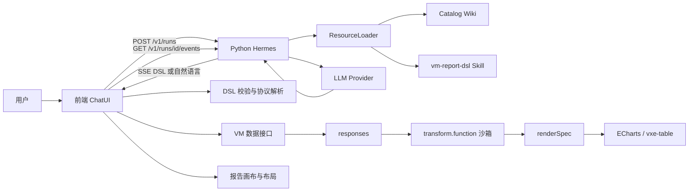

# vmChat AI Chat 技术架构与数据流

本文档以当前前端分支 `codex/vmchat-template-schema-20260804` 和 Python 项目 `vmchat-hermes-replacement-python` 的代码为准，说明 ChatUI、Python Hermes、catalog/Wiki、vm-report-dsl、VM 数据接口和渲染层之间的关系。

## 1. 项目结构

当前两个项目是同级、独立的 Git 仓库：

```text
/Volumes/onePiece/公司前端项目/AI项目/
├── jn-fof-gf-vue/
│   └── 前端 vmChat，分支 codex/vmchat-template-schema-20260804
└── vmchat-hermes-replacement-python/
    └── Python Hermes 后端，分支 master
```

| 项目 | 主要职责 |
| --- | --- |
| `jn-fof-gf-vue` | ChatUI、Hermes 请求、DSL 解析、VM 数据请求、DSL 执行、表格/图表和画布布局 |
| `vmchat-hermes-replacement-python` | Hermes API、运行任务、SSE 事件、Prompt、Skill 资源加载、LLM 调用、DSL 校验和修复 |

## Python 后端技术栈

Python Hermes 是一个 FastAPI 服务，不是直接嵌在前端里的 Python 脚本。它负责把一次 Chat 请求包装成可追踪的 run，并把模型生成过程转成前端能够消费的 SSE 事件。

### 2.1 核心依赖

依赖定义在 Python 项目的 `pyproject.toml`：

| 依赖 | 用途 |
| --- | --- |
| `FastAPI` | 定义 HTTP API、请求处理和中间件 |
| `uvicorn` | 启动 ASGI 服务，当前默认端口是 `7310` |
| `Pydantic` | 校验请求、DSL、配置和模型输出的数据结构 |
| `LangChain` | 抽象模型调用、结构化输出和工具调用循环 |
| `langchain-deepseek` | 提供 `ChatDeepSeek` 模型适配器 |
| `jsonschema` | 支持 DSL Schema 和业务校验 |
| `sse-starlette` | 提供 SSE 相关能力；当前主事件流由 FastAPI `StreamingResponse` 输出 |
| `python-dotenv` | 从 `.env` 加载本地模型和服务配置 |
| `pytest` / `httpx` | API、协议、资源和 Provider 测试 |

### 2.2 Python 服务分层

```text
app/main.py
  HTTP 层：health、wiki、templates、runs、events
        |
app/compatibility/
  Hermes 请求和 SSE 兼容层
        |
app/runs/
  run 创建、状态、并发限制、事件缓存
        |
app/orchestrator/
  Prompt -> 模型 -> 资源读取 -> DSL 校验/修复 -> SSE 事件
        |
app/provider/
  FixedProvider 或 LangChain + ChatDeepSeek
        |
app/resources/
  manifest、catalog、Skill、Wiki 资源加载
        |
app/validation/
  vm-report-dsl Schema 和 catalog contract 校验
```

## 2. 总体数据流



核心分工：

1. Hermes 理解问题、查找知识、生成 DSL 或自然语言说明。
2. 前端执行 DSL，不把 VM 数据查询交给 Python Hermes。
3. 前端根据 DSL 的 `sqlCode` 和参数调用 VM 数据接口。
4. 前端把响应组织为 `responses`，执行 `transform.function`。
5. 转换结果进入 table 或 ECharts 渲染器。
6. 报告块和拖拽布局是前端状态，Hermes 不直接操作布局。

## 3. 用户提问到 Hermes

### 3.1 前端收集上下文

用户在 `src/views/vmChat/index.vue` 输入问题后，前端会收集：

- 用户当前问题。
- 最近聊天历史。
- 当前画布已有的报告块 DSL。
- 当前选中的 `selectedBlockId`。
- 全局查询条件：产品、开始日期、结束日期、基准和频率。
- 当前协议版本和会话 ID。

前端通过 `buildVmHermesMessages` 组织这些内容，并显式激活：

```json
{
  "skills": ["vm-report-dsl"]
}
```

### 3.2 历史记录和工作区上下文管理

当前 vmChat 的上下文由两部分组成，二者用途不同：

| 上下文类型 | 内容 | 作用 |
| --- | --- | --- |
| 聊天历史 | 之前的 user/assistant 消息 | 让模型理解用户前后文和追问关系 |
| 工作区上下文 | 当前 block DSL、选中 block、全局查询条件 | 让模型知道当前画布状态，正确生成 create/update DSL |

#### 前端保存位置

聊天记录保存在 Vue 组件的内存状态：

```js
chatMessages: []
```

用户发送问题时，前端会先把本轮用户消息和助手占位消息放入 `chatMessages`，再构造本次请求。构造历史时会排除本轮正在处理的两条消息，只取之前已经存在的 user/assistant 消息。

实现位置：

```text
src/views/vmChat/index.vue
  sendMessage()
  chatMessages
```

前端不会把聊天历史写入数据库，也不会默认写入 localStorage。刷新页面后，`chatMessages` 会重新初始化为空数组。

#### 前端第一层裁剪

`buildVmHermesMessages()` 会对历史执行两层限制：

```js
historyMessages.slice(-8)
String(item.content).slice(0, 4000)
```

也就是说，单次发送最多携带最近 8 条历史消息，每条消息最多 4000 个字符。历史消息会被拼成 Hermes 的 `input`，当前用户问题作为最后一条 user 消息。

此外，前端会加入一条会话锚点消息，用于日志和会话关联。它不是用户真正的问题，也不应该被模型当成业务指令执行。

#### 发送给 Python 的格式

前端先把 system 消息拆成 `instructions`，把其他消息放入 `input`：

```json
{
  "instructions": "系统协议、当前 DSL、全局参数和工作区状态",
  "input": [
    {"role": "user", "content": "历史问题"},
    {"role": "assistant", "content": "历史回答"},
    {"role": "user", "content": "本轮问题"}
  ]
}
```

这一步位于：

```text
src/api/hermesResearch.js
  splitRunMessages()
  createHermesRun()
```

#### Python 第二层处理

Python 的 `normalize_vm_chat_input()` 会从 Hermes 请求中提取：

- 最后一条 user 消息作为当前 `userMessage`。
- 所有 user/assistant 消息作为 `historyMessages`。
- `instructions` 和消息内容中的 `currentDsls`。
- `selectedBlockId`。
- 全局查询条件。

实现位置：

```text
app/compatibility/hermes_request.py
  normalize_create_run_request()
  normalize_vm_chat_input()
```

Python 端会限制单次 `input` 最多 20 条消息、单条消息最多 16000 个字符。由于前端已经先限制为最近 8 条，正常情况下不会触发 Python 的 20 条上限。

#### Python 注入 Prompt

`build_generate_prompt()` 会再次取最近最多 10 条历史：

```python
raw_history = history_messages[-10:]
```

如果系统 Prompt、当前 DSL、全局参数和历史消息超过 `MAX_PROMPT_CHARS`，Python 会从最旧的历史消息开始删除，直到满足上下文预算。

最终模型看到的历史结构是：

```text
<chat_history>
user: 之前的问题
assistant: 之前的回答
user: 当前问题之前的追问
</chat_history>
```

实现位置：

```text
app/prompt/generate_prompt.py
  build_generate_prompt()
```

#### session_id 的作用

`session_id` 由前端创建并发送给 Python，主要用途是：

- 标识一次 vmChat 会话。
- 关联 Hermes run。
- 支持日志和调试追踪。

它不代表 Python 会自动从数据库恢复完整聊天历史。当前历史的真实来源仍然是前端本次请求携带的 `input`。

#### currentDsls 不是聊天历史

当前画布中的报告块 DSL 会单独放入系统上下文：

```text
当前 selectedBlockId
当前 selectedBlock
当前 currentDsls
当前 allBlockSummaries
当前全局查询条件
```

它们是“工作区状态”，不是自然语言聊天记录。Hermes 修改已有报告块时，应优先依据 `currentDsls` 和 `selectedBlockId` 判断目标，而不是依赖历史对话中可能出现的旧 DSL ID。

#### 当前历史管理边界

```text
页面内存 chatMessages
  -> 前端取最近 8 条，每条最多 4000 字符
  -> Hermes input
  -> Python 取最近 10 条
  -> 按 MAX_PROMPT_CHARS 继续裁剪旧消息
  -> 注入模型 Prompt
```

当前没有以下能力：

- 数据库级聊天记录。
- 刷新页面后自动恢复历史。
- 跨浏览器或跨设备共享历史。
- 仅凭 `session_id` 自动恢复历史。

如果未来需要长期会话记忆，应单独增加会话消息存储和恢复 API，不应把 `RunStore` 或 `session_id` 误当成完整的历史记忆系统。

### 3.3 前端代理地址

开发环境前端使用：

```text
/hermes-api
```

Webpack 代理转发到：

```text
http://127.0.0.1:7310
```

相关文件：

- `config/index.js`
- `src/api/hermesResearch.js`

### 3.4 创建运行任务

请求：

```http
POST /hermes-api/v1/runs
Content-Type: application/json
Authorization: Bearer <token>
```

关键请求字段：

```json
{
  "model": "deepseek-v4-flash",
  "input": [
    {"role": "user", "content": "用户问题"}
  ],
  "instructions": "系统协议和上下文",
  "session_id": "vm-chat-...",
  "skills": ["vm-report-dsl"],
  "tools": []
}
```

Python 服务的 `app.main.create_run` 会：

1. 检查资源是否加载完成。
2. 校验请求格式。
3. 只允许 `vm-report-dsl` skill。
4. 拒绝非空 `tools`；当前后端不执行外部工具。
5. 从请求中提取问题、历史、当前 DSL、选中块和全局参数。
6. 在 `RunStore` 中创建 `run_id`。
7. 返回任务 ID。

响应：

```json
{
  "run_id": "run_xxx",
  "status": "queued",
  "session_id": "vm-chat-..."
}
```

此时还没有返回最终 DSL，只是创建了一个可被事件流消费的任务。

### 3.5 接收 SSE

前端拿到 `run_id` 后请求：

```http
GET /hermes-api/v1/runs/{run_id}/events
Accept: text/event-stream
Authorization: Bearer <token>
```

Python 使用 `StreamingResponse` 返回事件。主要事件包括：

- `reasoning.delta`：模型思考片段。
- `message.delta`：模型可见输出片段。
- `run.completed` / `stream.done`：完成并携带最终输出。
- `run.failed`：执行失败。

前端拼接事件内容，更新右侧 AI 对话，然后将最终文本交给协议解析层。

## 4. Python Hermes 内部

### 4.0 Python 与模型的交互

模型适配位于：

```text
app/provider/fixed_provider.py
app/provider/langchain_provider.py
```

Python 通过 `VmChatModelProvider` 抽象模型能力，编排层不直接依赖某个具体模型。Provider 统一提供三类能力：

| Provider 能力 | 用途 |
| --- | --- |
| `generate` | 非流式生成，用于 DSL 修复或兼容调用 |
| `stream` | 普通模型文本流式输出 |
| `run_skill` | 带 Skill 资源读取能力的主链路 |

#### 真实模型模式：LangChain + ChatDeepSeek

当环境变量 `LLM_PROVIDER=langchain` 时，`app/main.py` 创建 `LangChainVmChatProvider`。它使用：

```python
from langchain_deepseek import ChatDeepSeek
from langchain_core.tools import tool
```

`ChatDeepSeek` 负责连接 DeepSeek 兼容模型接口，配置项包括：

```text
LLM_MODEL       模型名称，默认 deepseek-v4-flash
LLM_BASE_URL    模型服务地址，可选
LLM_API_KEY     模型服务密钥
LLM_OUTPUT_MODE structured 或 text-json
```

模型实例的关键参数当前是：

- `temperature=0`：尽量减少 DSL 随机性。
- `max_retries=0`：不自动重试非幂等的模型生成请求。
- `timeout=120`：单次模型调用超时时间。

模型调用大致是：

```text
systemPrompt + userPrompt
        |
ChatDeepSeek.ainvoke / ChatDeepSeek.astream
        |
模型返回文本、结构化对象或 tool call
        |
Provider 转成 ModelGenerateOutput / ModelStreamChunk
        |
orchestrator 校验 DSL 并转成 Hermes SSE
```

#### structured 模式

`LLM_OUTPUT_MODE=structured` 时，Provider 使用 LangChain 的：

```python
model.with_structured_output(
    VmChatModelResultSchema,
    name="vmchat_result",
    strict=True,
    include_raw=True,
)
```

模型输出被约束为两类结果：

```text
type=dsl   -> dsl 为一个对象或数组
type=text  -> category 为 clarify 或 reject，附带自然语言 text
```

#### text-json 模式

`LLM_OUTPUT_MODE=text-json` 时，Provider 使用普通 `ainvoke`，再由 Python：

1. 从模型文本中提取第一个完整 JSON 对象或数组。
2. 解析为 JSON。
3. 尝试校验为 `VmChatModelResultSchema`。
4. 如果不是包装对象，但看起来是 DSL，则作为直接 DSL 候选交给后续校验器。
5. 如果是中文自然语言且不包含完整 JSON，则作为澄清/拒绝文本。

这条路径是为了兼容某些不会严格遵循结构化输出的模型，但最终是否可执行仍由 DSL 校验器决定。

#### fixed 模式

默认配置是 `LLM_PROVIDER=fixed`。此时 Python 使用 `FixedVmChatProvider`，根据 Prompt 中的内容生成固定规则或 fixture 结果，主要用于：

- 本地开发。
- 单元测试。
- 协议回放。
- 没有配置真实模型密钥时验证 API 和 SSE 链路。

`FixedVmChatProvider` 在 `NODE_ENV=production` 时会主动拒绝启动，不能作为生产模型。

### 4.1 模型如何读取 Wiki 和 Skill 文档

这里有两条不同的“文档交互”路径，不能混为一谈。

#### 路径 A：模型读取资源

模型不是通过 HTTP 调用 `/v1/wiki/documents` 读取文档，而是通过 Python 内部注入的只读资源工具读取：

```text
read_vmchat_skill_resource(path)
```

实际实现链路是：

```text
ResourceLoader
  -> LoadedResources.toolResourceTextByPath
  -> SkillResourceReader
  -> LangChain tool
  -> ChatDeepSeek tool call
  -> Python 执行 read_resource(path)
  -> 返回 Markdown/JSON 文本给模型
```

允许读取的资源会在启动时建立白名单，包括：

```text
catalog/index.md
catalog/metrics.md
catalog/execution-contract.json
catalog/submodules.json
catalog/modules/<moduleId>.md
skill/references/dsl-spec.md
skill/references/dsl-table.md
skill/references/dsl-echarts.md
skill/references/merge-rules.md
```

`SkillResourceReader` 会执行安全控制：

- 只允许相对路径。
- 拒绝绝对路径、反斜杠和 `..` 路径穿越。
- 只允许 ResourceLoader 白名单中的文件。
- 同一文件不能重复读取。
- 有总字符预算。
- 最多限制资源读取次数，防止模型无限读取。

模型在一次请求中的典型读取顺序是：

```text
先读 catalog/index.md
  -> 再读 catalog/metrics.md
  -> 根据用户问题命中 moduleId
  -> 读 catalog/modules/<moduleId>.md
  -> 涉及合并或渲染时读对应 reference
  -> 依据读取到的内容生成 DSL
```

因此，模型看到的模块字段、`sqlCode`、单位和合并规则，来源是当前 Python 进程内加载的资源，而不是前端临时拼接的旧 metadata。

#### 路径 B：用户在前端打开 Wiki

用户点击前端的“Wiki 说明”时，才会走 HTTP Wiki API：

```text
前端 -> GET /v1/wiki/tree
前端 -> GET /v1/wiki/documents/{documentId}
Python -> 从 LoadedResources 返回 Markdown
前端 -> Markdown 渲染、搜索和高亮
```

所以：

- 模型读取文档：内部 Tool 调用，服务端内存读取。
- 用户浏览文档：HTTP API 调用，前端展示。
- 两条路径共享同一份 `resources/catalog` 文件，但调用目的不同。

### 4.2 启动和资源校验

Python 入口：

```text
vmchat-hermes-replacement-python/app/main.py
```

服务启动时，`ResourceLoader` 读取：

```text
resources/manifest.json
```

并执行：

- 文件存在性检查。
- SHA-256 校验。
- 未登记文件检查。
- catalog 模块数量检查。
- 每个模块 `sqlCode` 检查。
- 模块 Markdown、Skill 和 DSL Schema 检查。

资源正常时：

```json
{
  "status": "ok",
  "skillLoaded": true,
  "catalogLoaded": true,
  "schemaLoaded": true,
  "modelConfigured": true
}
```

资源不完整时，`/health` 和 `/v1/runs` 会返回 degraded/503，避免模型在缺少知识的情况下生成 DSL。

### 4.3 Catalog / Wiki

资源目录：

```text
resources/catalog/index.md
resources/catalog/metrics.md
resources/catalog/execution-contract.json
resources/catalog/submodules.json
resources/catalog/modules/*.md
```

作用：

- 模块目录和中文业务名称。
- 指标、维度与模块映射。
- `moduleId`、`sqlCode` 和子模块约束。
- 模块字段、单位、样例和渲染建议。

### 4.4 vm-report-dsl Skill

资源目录：

```text
resources/skill/SKILL.md
resources/skill/references/dsl-spec.md
resources/skill/references/dsl-table.md
resources/skill/references/dsl-echarts.md
resources/skill/references/merge-rules.md
resources/schemas/dsl.schema.json
```

作用：

- 判断回答、澄清、拒绝、新建还是更新。
- 规定 DSL 顶层结构。
- 规定 `requests`、`transform`、`view`。
- 规定模块合并和子模块规则。
- 规定表格和 ECharts 视图。
- 防止模型自行编造 `sqlCode`。

当前 Skill 要求模型按需读取：

1. `catalog/index.md`
2. `catalog/metrics.md`
3. 命中的 `catalog/modules/<moduleId>.md`
4. 必要时读取 contract、submodules 和 DSL reference

Wiki 是给用户看的知识浏览界面，Skill 是给模型遵循的规则入口，但二者使用同一套 catalog 事实源。

### 4.5 Prompt 组装

Python 的 `build_generate_prompt` 会组合：

- `SKILL.md` 规则。
- 资源读取工具说明。
- 当前已有 DSL。
- 当前选中的 block。
- 全局查询参数及是否为空。
- 用户问题。
- 最近最多 10 条历史消息。

模型的输出目标不是直接返回查询结果，而是返回前端可执行的 DSL，或在需求不明确/不允许执行时返回自然语言说明。

## 5. Hermes 输出和校验

### 5.1 create DSL

新模块使用 `action=create`：

```json
{
  "action": "create",
  "id": "dsl-uuid",
  "title": "现金类持仓时序",
  "params": {
    "productCode": "SM0513",
    "beginDate": "2022-01-01",
    "endDate": "2022-01-31",
    "dataFreq": "日频"
  },
  "requests": [
    {
      "id": "request-uuid",
      "moduleId": "cashPositionTiming",
      "sqlCode": "b9f4277e-..."
    }
  ],
  "transform": {
    "function": "function transform(responses) { return ... }"
  },
  "view": {
    "type": "echarts",
    "title": "现金类持仓时序",
    "series": []
  }
}
```

具体字段以 `resources/skill/references/dsl-spec.md` 和 Schema 为准。

### 5.2 update DSL

更新必须：

- 使用 `action=update`。
- 指定明确的 `targetBlockId`。
- 复用原 block 的 DSL `id`。
- 以完整 DSL 替换原 block，而不是做隐式局部 patch。

### 5.3 Python 校验和自动修复

校验器：

```text
app/validation/validate_vm_report_dsl.py
```

主要检查：

- `action`、`id`、`targetBlockId`。
- `requests` 是否存在且格式正确。
- `moduleId`、`submoduleId`、`sqlCode` 是否符合 catalog contract。
- `transform.function` 是否引用请求并返回数组。
- table/ECharts view 是否符合 Schema。
- create/update 是否匹配当前画布。
- 跨模块合并是否符合 `merge-rules.md`。

第一次生成不通过时，Python 端将验证错误、候选 DSL 和资源上下文交给修复 Prompt，最多自动修复 5 次。仍失败则返回 `DSL_REPAIR_EXHAUSTED`，前端不会把它当成可执行报告块。

## 6. 前端执行 DSL 和查询数据

Python Hermes 只生成 DSL，不执行 `sqlCode` 查询。前端的主要执行文件是：

- `src/views/vmChat/vm-report-dsl-runtime.js`
- `src/views/vmChat/vm-block-hydrator.js`
- `src/views/vmChat/vm-query-executor.js`
- `src/views/vmChat/vm-api.js`

执行步骤：

1. 读取 DSL 的 `params` 和 `requests[]`。
2. 合并全局参数，形成最终请求参数。
3. 按 request 调用 VM 接口。
4. 归一化响应结构。
5. 组织 `responses`。
6. 执行 `transform.function`。
7. 将数组注入 table 或 ECharts。

### 6.1 示例数据模式

当前 `createVmRequestFetcher()` 默认使用 `example` 模式：

```http
POST /api/report/v1.0/data/test/sql/{sqlCode}
```

这个模式主要用于模块展示和联调，默认不携带完整全局查询参数。

### 6.2 真实数据模式

真实数据模式使用：

```http
GET /rest/report/getSqlDataBySqlCode.do?sqlCode=<sqlCode>&...
```

产品、日期、基准和频率等参数作为查询参数传递。

旧模板型请求使用：

```http
GET /rest/report/interview.do?templateCode=<templateCode>&...
```

当前新协议的主路径应使用 `requests[].sqlCode`，不应重新引入旧的 metadata -> queryPlan 主链。

### 6.3 响应归一化和去重

VM 接口可能返回数组、`body`、`data`、`rows`、`data.list` 等结构。前端统一为：

```text
payloadByRequestId[requestId]  # 原始响应
rowsByRequestId[requestId]     # 行数组
timings[requestId]             # 耗时和行数
```

相同 `sqlCode + params` 的 request 会去重，避免重复请求。

## 7. transform.function 和渲染

前端把各请求结果组织为：

```json
{
  "request-uuid": {
    "body": []
  }
}
```

然后执行：

```javascript
function transform(responses) {
  return []
}
```

当前执行限制：

- 只允许 `function transform(responses)` 入口。
- 只暴露只读 `responses`。
- 禁止 `window`、`document`、`fetch`、`XMLHttpRequest`、`localStorage`、`sessionStorage`、`globalThis`、`eval` 等标识。
- 在隔离 iframe/Worker 中运行。
- 有超时和异常捕获。
- 返回值必须是数组。

成功后：

- `view.type=table`：结果写入 `renderSpec.rows`。
- `view.type=echarts`：结果写入 `renderSpec.option.dataset.source`。

失败后：

- `renderState.status=error`。
- `sourceData.runtime.lastError` 记录原因。
- `transformDiagnostics` 记录错误。
- 保留原 block，不清空整个画布。

## 8. 前端渲染和布局

报告块核心状态包括：

```text
blockId
title
type / viewType
dsl
queryContext
renderSpec
renderState
sourceData.runtime
requestDiagnostics
transformDiagnostics
renderSnapshot
```

渲染层继续复用：

- `view.type=table`：现有 vxe-table。
- `view.type=echarts`：现有 ECharts 封装。

Hermes 只返回普通报告块操作：

- `appendBlock`
- `replaceBlock`
- `removeBlock`
- `moveBlock`
- `renameBlock`

布局是纯前端能力：

- 多选顶层模块。
- 点击“合并模块”生成 group。
- group 内部有独立的 24 栏网格。
- group 可保存为整体模板。
- 恢复模板时生成新的 block/group ID。
- 解散 group 时子模块回到顶层。

发送问题给 Hermes 时，前端会把 group 内的 block 展平为 DSL 列表，所以 Hermes 不需要理解拖拽布局。

## 9. Wiki API 和模板 API

### Wiki

```http
GET /hermes-api/v1/wiki/tree
GET /hermes-api/v1/wiki/documents/{documentId}
```

Python 从已加载资源返回目录树和 Markdown 文档；前端负责目录树、Markdown、搜索和高亮。

### 模板

```http
GET    /v1/templates
GET    /v1/templates/{templateId}
POST   /v1/templates
PUT    /v1/templates
PUT    /v1/templates/{templateId}
DELETE /v1/templates/{templateId}
```

模板可以保存单个 block、group 或完整画布布局。恢复时必须生成新的实例 ID，不能直接复用原 block ID。

## 10. 异常排查

| 现象 | 优先检查 |
| --- | --- |
| 没有 `run_id` | Python `/v1/runs`、请求体、认证、资源状态 |
| `Failed to fetch` | 代理地址、CORS、SSE 连接和 7310 服务 |
| 有 run 但没有事件 | `/v1/runs/{id}/events`、响应头和 Python 日志 |
| JSON 解析失败 | Hermes 最终输出、协议提取、转义和尾部文本 |
| 顶层 action 错误 | Skill DSL 规则、Python 校验器、前端协议层 |
| DSL 合法但无数据 | `sqlCode`、参数和 VM API 响应结构 |
| transform 失败 | `transform.function`、responses 和沙箱限制 |
| 图表/表格空白 | `renderSpec`、view、ECharts/vxe-table 映射 |

一次请求应沿同一 `traceId` 追踪：

```text
ui.send.start
 -> hermes.run.create.start
 -> hermes.run.created
 -> hermes.run.headers
 -> hermes.run.event / run.chunk
 -> hermes.run.completed
 -> protocol.parse.start
 -> block-hydrator.hydrate.start
 -> vm-api.request.start
 -> vm-api.request.success / request.error
 -> query-executor.plan.done
 -> render / ui.send.done
```

## 11. 当前已知边界

1. 前端默认数据模式是 `example`，真实查询必须明确切换 `dataMode=live`。
2. 前端默认分析模型常量目前是 `deepseek-v4-flash`，不能只看 UI 文案判断后端实际模型。
3. 当前 Python 项目的路由列表中没有发现 `/v1/chat/completions`。前端虽然保留普通请求和流式 Chat Completion 兼容入口，但当前 Python 主协议可确认的是 `/v1/runs` 与 `/v1/runs/{runId}/events`。事件流失败时，不能默认降级接口一定可用。
4. `transform.function` 属于动态代码执行，必须继续限制输入、超时和可访问对象。
5. `manifest.json`、catalog、Skill 和 Schema 必须一起发布，否则 Python 服务会 degraded 或拒绝资源。

## 12. 一句话总结

```text
用户问题
 -> 前端上下文
 -> Python Hermes
 -> catalog + vm-report-dsl Skill
 -> LLM 生成 DSL
 -> Python 校验/修复
 -> SSE 返回前端
 -> 前端按 sqlCode 请求 VM 数据
 -> responses
 -> transform.function
 -> renderSpec
 -> ECharts / vxe-table
 -> 报告画布与布局
```
